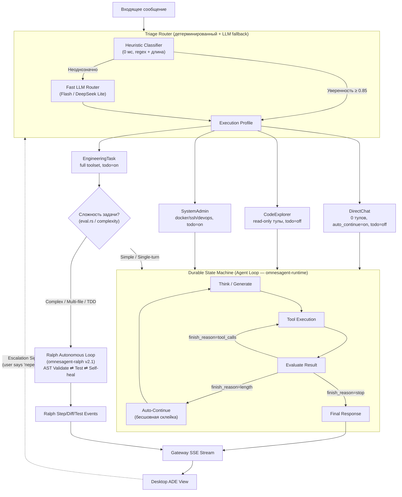
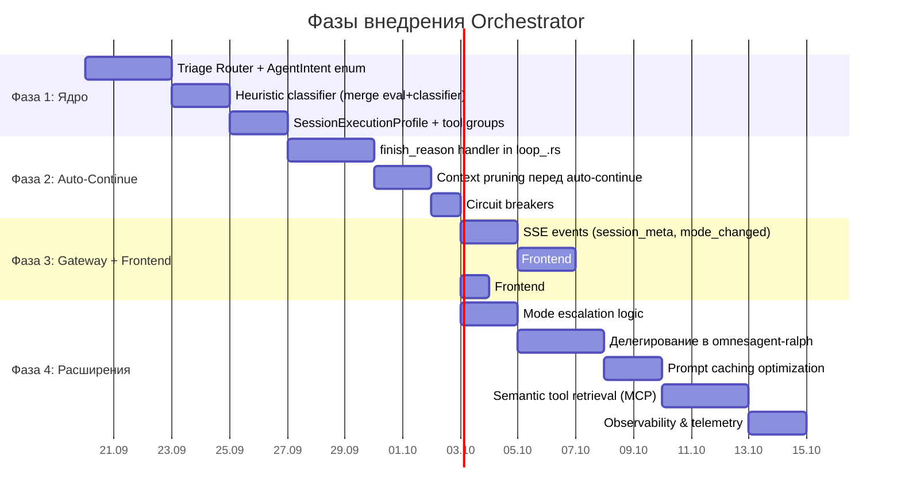

# Архитектурный план: Intent & Tool Orchestrator для OmnesAgent

> **Версия:** 2.0 (2026-09-19)
> **Цели:** Устранить обрывы сообщений, паразитные TODO-блоки при обычных вопросах, оптимизировать контекстное окно LLM через интеллектуальную маршрутизацию интентов, динамическую подгрузку инструментов и бесшовный стриминг.

---

## 1. Аудит текущей кодовой базы (OB2H AST-анализ)

> AST-сканирование: **1 242 файла**, **40 651 узел графа**, **49 964 связи**.
> Циклических зависимостей: **0** (архитектура ациклична ✅).

### 1.1 Что уже есть и чего не хватает

| Компонент | Файл | Что делает | Чего не хватает |
|---|---|---|---|
| **Channel Orchestrator** | [`orchestrator/mod.rs`](file:///c:/Projects/Omnes-agent/backend/crates/omnesagent-channels/src/orchestrator/mod.rs) | Маршрутизация между каналами связи (Telegram, Slack, Matrix, Discord, Voice, Webhooks). 876 исходящих связей — 2-й God Node. | Это не интеллектуальный оркестратор: он маршрутизирует _транспорт_, а не _интент запроса_. |
| **Query Classifier** | [`classifier.rs`](file:///c:/Projects/Omnes-agent/backend/crates/omnesagent-runtime/src/agent/classifier.rs) | Статическая проверка ключевых слов + длины сообщения → возвращает `hint` для выбора модели (`hint:fast`, `hint:code`). | Не разделяет режимы агента (чат vs кодинг). Не управляет набором тулов. Не влияет на UI (TODO-виджеты). |
| **Complexity Evaluator** | [`eval.rs`](file:///c:/Projects/Omnes-agent/backend/crates/omnesagent-runtime/src/agent/eval.rs) | Эвристика `estimate_complexity()`: Simple / Standard / Complex на основе длины + ключевых слов (`explain`, `refactor`, `debug` и др.). | Используется только для auto-classify fallback подбора модели. Не влияет на tool selection. |
| **Context Analyzer** | [`context_analyzer.rs`](file:///c:/Projects/Omnes-agent/backend/crates/omnesagent-runtime/src/agent/context_analyzer.rs) | `analyze_turn_context()` → `ContextSignals { suggested_tools, history_relevant }`. Анализирует предыдущие tool calls и ключевые слова ассистента. | Работает только на iteration ≥ 1 (внутри цикла). На первом сообщении всегда возвращает пустой `suggested_tools`. Не определяет _режим_ сессии. |
| **Prompt Caching** | [`openrouter.rs`](file:///c:/Projects/Omnes-agent/backend/crates/omnesagent-providers/src/openrouter.rs) | Реализован `cache_control: ephemeral` для system prompt + подсчёт `cached_tokens`. | Кэширование только для OpenRouter. Нет стратегического Static Prefix Pattern для остальных провайдеров. |
| **Tool Pruning в Loop** | [`loop_.rs`](file:///c:/Projects/Omnes-agent/backend/crates/omnesagent-runtime/src/agent/loop_.rs) (18 151 строка) | Основной цикл агента. | **Нет** обработки `finish_reason: length` → **нет** auto-continue. Нет динамической фильтрации тулов по интенту на первом сообщении. |
| **Frontend TODO** | [`task_workspace_view.dart`](file:///c:/Projects/Omnes-agent/frontend/desktop/lib/features/workspace/task_workspace_view.dart#L3330-L3360) | `parseTodoBlocksFromText()` агрессивно парсит слова «План:», «Задачи:», `- [ ]` из _любого_ ответа и выносит наверх. `_buildSessionTodoBlockFromTimeline()` безусловно показывает timeline steps. | Нет флага `show_todo_widget` от бэкенда. TODO показывается даже при ответе на простой вопрос. |
| **Policy & Safety** | [`policy.rs`](file:///c:/Projects/Omnes-agent/backend/crates/omnesagent-config/src/policy.rs) | `ToolOperation::Read` vs `Act`, `CommandRiskLevel`, `ActionTracker` с rate limiting. | Хороший фундамент для привязки к оркестратору: в режиме Chat блокировать Act-операции, в Explorer — разрешать только Read. |
| **Ralph Orchestrator** | [`omnesagent-ralph`](file:///c:/Projects/Omnes-agent/backend/crates/omnesagent-ralph) (`loop_driver.rs`, `executor.rs`) | Полноценный автономный агент-разработчик (Ralph Loop v2.1 × OpenCode interpreter × AST/OB2H validation × self-healing test loop × diff generation). | Работает изолированно как standalone/background worker. Не интегрирован в общий Triage Router: сейчас любой запрос на код идёт в общий монолитный `loop_.rs` вместо делегирования оптимизированному Ralph-конвейеру. |

### 1.2 Архитектурный вердикт

> **Нет единого интеллектуального оркестратора.** Существующие компоненты (`classifier`, `eval`, `context_analyzer`) — это разрозненные эвристики, работающие на разных уровнях абстракции. Их необходимо объединить в **единую точку принятия решений (Triage Router)**, которая:
> 1. Определяет _интент_ запроса (Chat / Explore / Engineer).
> 2. Формирует _профиль исполнения_ (набор тулов, системный промпт, UI-флаги).
> 3. Управляет _эскалацией_ режима посреди разговора без потери контекста.

---

## 2. Архитектура решения: Unified Triage & Execution Orchestrator



---

## 3. Пошаговый план реализации

### Этап 1. Backend — Unified Triage Router

#### 1.1 Новый модуль `omnesagent-runtime/src/agent/orchestrator/`

```
orchestrator/
├── mod.rs              // Публичный API: triage() → ExecutionProfile
├── intent.rs           // Enum AgentIntent + классификация
├── profile.rs          // SessionExecutionProfile (тулы, промпт, UI-флаги)
├── escalation.rs       // Логика повышения/понижения режима mid-session
└── tests.rs            // Unit + интеграционные тесты
```

#### 1.2 `AgentIntent` — перечисление режимов

```rust
#[derive(Debug, Clone, Copy, PartialEq, Eq, Serialize)]
pub enum AgentIntent {
    /// Обычный вопрос, объяснение, консультация.
    /// Не требует инструментов. Ответ стримится чисто.
    DirectChat,
    /// Исследование проекта: поиск по коду, архитектурные вопросы.
    /// Только read-only тулы (read_file, grep, ob2h, AST).
    CodeExploration,
    /// Генерация / модификация кода, запуск тестов, рефакторинг.
    /// Полный набор тулов. Включает TODO-трекинг и approval flow.
    EngineeringTask,
    /// DevOps: Docker, SSH, миграции, деплой.
    /// Полный набор + повышенный контроль (approval для destructive ops).
    SystemAdmin,
}
```

#### 1.3 Гибридная классификация (Heuristic + LLM fallback)

> **Критическое требование 2026:** Маршрутизатор не должен добавлять задержку > 50 мс для очевидных случаев. LLM-маршрутизация — только для неоднозначных запросов.

**Уровень 1 — Детерминированная эвристика (0 мс, ~80% запросов):**

| Сигнал | Intent |
|---|---|
| Нет глаголов действия¹, нет файловых путей, длина < 300 символов | `DirectChat` |
| Глаголы чтения² + упоминание файла/модуля/функции, нет глаголов модификации | `CodeExploration` |
| Глаголы модификации³ или содержит code fence `` ``` `` | `EngineeringTask` |
| Ключевые слова DevOps⁴ | `SystemAdmin` |

> ¹ «создай», «исправь», «перепиши», «запусти», «удали», «добавь», «протестируй»
> ² «найди», «покажи», «где», «объясни как», «что делает»
> ³ «создай», «измени», «запусти тест», «исправь баг», «отрефактори»
> ⁴ «docker», «деплой», «миграция», «ssh», «kubernetes»

**Уровень 2 — Fast LLM Router (< 200 мс, ~20% запросов):**

Для сообщений, не попавших в эвристику с высокой уверенностью:
- Вызвать быструю модель (Gemini Flash / DeepSeek Lite / локальная модель) с жёсткой JSON-схемой:
  ```json
  { "intent": "DirectChat" | "CodeExploration" | "EngineeringTask" | "SystemAdmin" }
  ```
- Кэшировать результат классификации на время сессии для follow-up сообщений.

**Интеграция с существующими компонентами:**
- Объединить логику из [`classifier.rs`](file:///c:/Projects/Omnes-agent/backend/crates/omnesagent-runtime/src/agent/classifier.rs) (ключевые слова + паттерны) и [`eval.rs`](file:///c:/Projects/Omnes-agent/backend/crates/omnesagent-runtime/src/agent/eval.rs) (`estimate_complexity`) в единый конвейер.
- `context_analyzer.rs` → вызывать на iteration ≥ 1 как дополнительный сигнал для tool refinement _внутри_ цикла (уже работает).

#### 1.4 `SessionExecutionProfile` — профиль исполнения

```rust
// Бэкенд исполнения задачи
#[derive(Debug, Clone, Copy, PartialEq, Eq, Serialize)]
pub enum ExecutionEngine {
    /// Обычный агентский цикл omnesagent-runtime (интерактивный чат, поиск, быстрые правки).
    StandardLoop,
    /// Автономный цикл разработки Ralph (omnesagent-ralph v2.1) для комплексных инженерных задач.
    RalphAutonomous,
}

pub struct SessionExecutionProfile {
    /// Определённый интент сессии.
    pub intent: AgentIntent,
    /// Движок исполнения (StandardLoop vs RalphAutonomous).
    pub engine: ExecutionEngine,
    /// Динамически отфильтрованный набор тулов.
    pub allowed_tools: Vec<ToolSpec>,
    /// Оверлей системного промпта (например, «Отвечай кратко и по делу»).
    pub system_prompt_overlay: Option<String>,
    /// Автоматическое продолжение при finish_reason == length.
    pub auto_continue: bool,
    /// Максимальное число авто-продолжений (circuit breaker).
    pub max_auto_continue_rounds: u8,
    /// UI-флаги, передаваемые через SSE.
    pub ui_flags: UiFlags,
}

pub struct UiFlags {
    /// Показывать ли TODO-виджет над ответом.
    pub show_todo_widget: bool,
    /// Показывать ли timeline шагов сессии.
    pub show_session_timeline: bool,
    /// Показывать ли статус выполнения Ralph (фазы, тесты, diff).
    pub show_ralph_progress: bool,
    /// Режим для отображения в header UI.
    pub display_mode: String, // "chat" | "explore" | "task" | "admin" | "ralph"
}
```

**Привязка к [`policy.rs`](file:///c:/Projects/Omnes-agent/backend/crates/omnesagent-config/src/policy.rs):**
- Для `DirectChat` → блокировать все `ToolOperation::Act` на уровне policy.
- Для `CodeExploration` → разрешать только `ToolOperation::Read`.
- Для `EngineeringTask` / `SystemAdmin` → полный доступ с rate limiting через `ActionTracker`.
- Для `RalphAutonomous` → делегирование политик в sandbox-исполнитель `omnesagent-ralph::executor::RalphExecutor`.

---

### Этап 2. Backend — Seamless Auto-Continue (State Machine Loop)

> **Индустриальный стандарт 2026:** Persistent state machine вместо рекурсии. Паттерн «Deterministic Harness + Streaming Tool Executor».

#### 2.1 Обработка `finish_reason: length` в `loop_.rs`

В текущем [`loop_.rs`](file:///c:/Projects/Omnes-agent/backend/crates/omnesagent-runtime/src/agent/loop_.rs) (18 151 строка) **нет обработки** truncation. Необходимо добавить:

```rust
// Псевдокод для agent state machine:
loop {
    let response = provider.stream_completion(&messages, &profile.allowed_tools).await?;
    
    match response.finish_reason.as_deref() {
        Some("stop") => {
            // Финальный ответ — отправить в SSE и завершить цикл.
            break;
        }
        Some("tool_calls") => {
            // Выполнить инструменты, добавить результаты в messages.
            execute_tools(&response.tool_calls, &mut messages).await?;
        }
        Some("length") if profile.auto_continue && continue_count < profile.max_auto_continue_rounds => {
            // Бесшовное продолжение: НЕ разрывать SSE-поток.
            // Добавить токен-продолжение и повторить генерацию.
            messages.push(continue_prompt(&response.partial_content));
            continue_count += 1;
        }
        _ => break,
    }
}
```

#### 2.2 Context Pruning между итерациями

> **Best Practice 2026:** Selective Truncation — между раундами автоматически убирать объёмные `tool_result` из промежуточных шагов, оставляя только user prompt + финальный assistant response.

- Использовать существующий [`history_pruner.rs`](file:///c:/Projects/Omnes-agent/backend/crates/omnesagent-runtime/src/agent/history_pruner.rs) и [`history_trim.rs`](file:///c:/Projects/Omnes-agent/backend/crates/omnesagent-runtime/src/agent/history_trim.rs) — они уже есть в кодовой базе, нужно убедиться, что они активируются перед каждым auto-continue раундом, а не только при явном переполнении окна.

---

### Этап 3. Backend — Dynamic Tool Pruning (Фильтрация инструментов по интенту)

> **Research 2025-2026 (AutoTool, Lunar.dev):** Подача 30+ tool definitions в каждый запрос к LLM увеличивает «tool space interference» — модель начинает галлюцинировать вызовы тулов, которые не нужны. Semantic tool pruning снижает ошибки выбора инструментов на 35-60%.

#### 3.1 Статические Tool Groups (Namespacing)

```rust
pub enum ToolGroup {
    /// Группа для DirectChat: пустой набор тулов.
    None,
    /// Read-only инструменты для Code Exploration.
    ReadOnly,   // file_read, content_search, glob_search, web_search, memory_recall
    /// Полный набор для Engineering.
    FullStack,  // все read + file_write, file_edit, shell, git_operations
    /// DevOps-специфичные.
    DevOps,     // shell, docker, ssh, deployment
}
```

#### 3.2 Semantic Tool Retrieval (для MCP-тулов)

Для крупных наборов MCP-инструментов (когда подключено 50+ тулов от внешних серверов):
- Embed descriptions тулов через OB2H embedding model (MiniLM 384d — уже есть).
- При классификации интента → vector search top-K релевантных тулов.
- Передавать в LLM только top-5…10 + статическую базу для текущего профиля.

---

### Этап 4. Backend — Prompt Caching Strategy (Static Prefix Pattern)

> **Best Practice 2026:** System prompt + tool definitions = стабильный «static prefix». Динамический контент (история, user message) идёт после. Это гарантирует попадание в prefix cache у Anthropic (~90% скидка), OpenAI (~50% скидка), DeepSeek (prompt_cache_hit).

#### 4.1 Порядок сборки промпта (cache-friendly)

```
┌────────────────────────────────────────────┐  ← STATIC PREFIX (кэшируется)
│ 1. System Prompt (personality + rules)     │
│ 2. Tool Definitions (зависят от профиля)   │
│ 3. AGENTS.md / project conventions         │
├────────────────────────────────────────────┤  ← cache_control breakpoint
│ 4. Conversation History (pruned)           │  ← DYNAMIC SUFFIX
│ 5. Current User Message                    │
└────────────────────────────────────────────┘
```

#### 4.2 Интеграция с существующим кэшированием

- [`openrouter.rs`](file:///c:/Projects/Omnes-agent/backend/crates/omnesagent-providers/src/openrouter.rs) уже реализует `cache_control: ephemeral` для system message — расширить на tool definitions block.
- Для [`compatible.rs`](file:///c:/Projects/Omnes-agent/backend/crates/omnesagent-providers/src/compatible.rs) (DeepSeek, Qwen) — добавить аналогичные `prompt_cache_hit_tokens` маркеры.
- **Анти-паттерн:** не вставлять timestamps, session IDs или другие динамические маркеры в начало промпта (cache-busting).

---

### Этап 5. Backend — Seamless Mode Escalation

> **Best Practice 2026:** Режим сессии — это не фиксированная классификация, а «уровень привилегий», который можно повышать и понижать на лету. Как в Unix: read-only → read-write-execute.

#### 5.1 Escalation Triggers

| Ситуация | Текущий режим | Новый режим |
|---|---|---|
| Пользователь начал с «Как работает парсер SSE?» | DirectChat | → DirectChat (без изменений) |
| Следующее сообщение: «Перепиши его на nom» | DirectChat | → EngineeringTask (escalation) |
| Задача завершена, пользователь спрашивает «Что ты изменил?» | EngineeringTask | → CodeExploration (de-escalation) |

#### 5.2 Реализация в `orchestrator/escalation.rs`

```rust
pub fn evaluate_escalation(
    current: AgentIntent,
    new_message: &str,
    session_history: &[ConversationMessage],
) -> AgentIntent {
    let new_intent = classify_intent(new_message);
    
    // Повышение всегда разрешено.
    if new_intent.privilege_level() > current.privilege_level() {
        return new_intent;
    }
    
    // Понижение: только если последние N сообщений не содержат tool calls.
    if new_intent.privilege_level() < current.privilege_level()
        && no_tool_calls_in_last_n(session_history, 3)
    {
        return new_intent;
    }
    
    current // Остаёмся в текущем режиме.
}
```

#### 5.3 Сохранение контекста при эскалации

- **Не сбрасывать** conversation history.
- **Динамически подгрузить** новые тулы без restart сессии: `profile.allowed_tools = load_tools_for(new_intent)`.
- Передать SSE-событие `ModeChanged { old: "chat", new: "task" }` для обновления UI.

#### 5.4 Двухуровневая маршрутизация задач разработки: Interactive Loop vs Ralph Autonomous Engine

В OmnesAgent уже разработан специализированный крейт [`omnesagent-ralph`](file:///c:/Projects/Omnes-agent/backend/crates/omnesagent-ralph), реализующий спецификацию Ralph v2.1. Это автономный цикл разработки с AST/OB2H валидацией, генерацией спеки, запуском тестов и циклом самолечения (self-healing).

Вместо того чтобы заставлять общий `loop_.rs` обрабатывать сложные мульти-файловые правки с компиляцией и тестами, Triage Router задействует **двухуровневое исполнение (Two-Tier Engineering Execution)**:

| Уровень | Сценарий | Исполнитель | Особенности |
|---|---|---|---|
| **Tier 1: Interactive Code Assistance** | Вопросы по коду, сниппеты, правка 1 файла, объяснение ошибки | `omnesagent-runtime::agent::loop_` | Быстрый стриминг, обычный чат-интерфейс, минимальный оверхед |
| **Tier 2: Autonomous Ralph Engine** | Новая фича, рефакторинг нескольких модулей, TDD с тестами, баг-фикс с верификацией | `omnesagent-ralph::loop_driver::RalphLoopDriver` | Генерация плана/спеки (`RalphSpec`), фазы разработки, запуск тестов через `executor.rs`, AST/OB2H валидация diff, self-healing до 3 итераций |

**Критерии переключения на Ralph Engine:**
- Интент классифицирован как `EngineeringTask`.
- Сложность из [`eval.rs`](file:///c:/Projects/Omnes-agent/backend/crates/omnesagent-runtime/src/agent/eval.rs) `estimate_complexity() == TaskComplexity::Complex` ИЛИ в запросе явно указаны директивы: «протестируй», «напиши тесты», «сделай фичу», «отрефактори модуль», пути к >1 файлу.
- Результаты фаз Ralph транслируются через Gateway SSE как структурированный прогресс (Task Timeline), где отображение TODO/Status является естественным и ожидаемым.

---

### Этап 6. Gateway — Протокол SSE с флагами режима

#### 6.1 Новые SSE-события

```json
// При начале генерации:
{
  "event": "session_meta",
  "data": {
    "mode": "chat",
    "show_todo_widget": false,
    "show_session_timeline": false,
    "auto_continue_active": true
  }
}

// При эскалации:
{
  "event": "mode_changed",
  "data": {
    "old_mode": "chat",
    "new_mode": "task",
    "show_todo_widget": true,
    "reason": "User requested code modification"
  }
}

// При auto-continue (невидимый для пользователя, но UI знает):
{
  "event": "auto_continue",
  "data": { "round": 2, "max_rounds": 5 }
}

// При делегировании сложной задачи в Ralph Orchestrator:
{
  "event": "ralph_phase_progress",
  "data": {
    "task_id": "ralph-8f2a1b",
    "phase": "Specifying",      // "Analyzing" | "Specifying" | "Coding" | "Testing" | "Done"
    "description": "Генерация спецификации и AST-анализ графа зависимостей",
    "completed_steps": 2,
    "total_steps": 5
  }
}
```

#### 6.2 Обратная совместимость

- Если фронтенд не поддерживает новые события → игнорирует их (graceful degradation).
- `GatewayFrame` во Flutter ([`gateway_frame.dart`](file:///c:/Projects/Omnes-agent/frontend/shared/lib/core/gateway/models/gateway_frame.dart)) получит новые типы фреймов.

---

### Этап 7. Frontend — Исправление TODO и бесшовный стриминг

#### 7.1 [`task_workspace_view.dart`](file:///c:/Projects/Omnes-agent/frontend/desktop/lib/features/workspace/task_workspace_view.dart)

**Изменения в `_buildMessageContent()` (строки 3329–3360):**

```diff
 Widget _buildMessageContent(BuildContext context, ChatMessage msg) {
+  // Проверяем флаг от бэкенда: показывать ли TODO.
+  final showTodo = msg.metadata?['show_todo_widget'] == true
+      || widget.controller.currentSessionMode.value == 'task';
+
   final todosInMsg = msg.todoBlocks.isNotEmpty
       ? msg.todoBlocks
-      : DesktopTaskWorkspaceController.parseTodoBlocksFromText(msg.text);
+      : showTodo
+          ? DesktopTaskWorkspaceController.parseTodoBlocksFromText(msg.text)
+          : <TodoBlockData>[];

   TodoBlockData? sessionTodoBlock;
-  if (todosInMsg.isEmpty && isLastBotMessage && widget.controller.runTimelineSteps.isNotEmpty) {
+  if (showTodo && todosInMsg.isEmpty && isLastBotMessage && widget.controller.runTimelineSteps.isNotEmpty) {
     sessionTodoBlock = _buildSessionTodoBlockFromTimeline();
   }
```

#### 7.2 [`task_workspace_controller.dart`](file:///c:/Projects/Omnes-agent/frontend/desktop/lib/features/workspace/task_workspace_controller.dart)

- Добавить `RxString currentSessionMode = 'chat'.obs;`.
- Обновлять при получении SSE-события `session_meta` / `mode_changed`.
- `parseTodoBlocksFromText` → **не вызывать** если `currentSessionMode == 'chat'`.

#### 7.3 Кнопки «Далее» / «Продолжить»

- Отображать **только** при `ApprovalFlow` (деструктивные операции: `rm`, `DROP`, `docker rm`).
- **Никогда** не показывать для продолжения текстового ответа — это теперь бесшовный auto-continue на бэкенде.

---

### Этап 8. Observability & Circuit Breakers

> **Best Practice 2026:** Без наблюдаемости оркестратор — чёрный ящик. Нужны метрики на каждый уровень.

#### 8.1 Телеметрия классификации

- Логировать каждое решение Triage Router через [`omnesagent-log`](file:///c:/Projects/Omnes-agent/backend/crates/omnesagent-log):
  ```json
  {
    "event": "triage_decision",
    "intent": "DirectChat",
    "method": "heuristic",       // или "llm_router"
    "confidence": 0.92,
    "latency_ms": 0,             // или 180 для LLM
    "tools_count": 0,
    "escalated_from": null
  }
  ```

#### 8.2 Circuit Breakers

| Защита | Порог | Действие |
|---|---|---|
| Auto-continue rounds | ≤ 5 | Прервать генерацию, показать частичный ответ |
| Tool execution per turn | ≤ 20 | Прервать loop, запросить подтверждение пользователя |
| Total session tokens | ≤ 200K | Активировать aggressive pruning через `history_pruner.rs` |
| LLM Router latency | > 500 мс | Fallback на heuristic с default intent |
| Escalation frequency | > 3 за 5 сообщений | Зафиксировать режим, не переключать |

---

### Этап 9. Backend: Token Compression Proxy Stack & Model-Family Routing

> **Исследование стека компрессии на рабочей машине:**
> На системе развернут проверенный стек сжатия контекста:
> - **`Headroom` (HTTP `127.0.0.1:8787`)**: Реверсивный прокси сжатия вывода инструментов: JSON (SmartCrusher −92%), AST-код (−47%), текст ML (−73%).
> - **`sqz` (v1.3.0 CLI + hook)**: Дедупликация повторного чтения файлов в 13-токенные контентные хэши (−92%), сжатие длинного вывода консоли (`sqz compress`).
> - **`mcp-compressor` (Atlassian Labs, Rust)**: Сжатие JSON-схем и описаний MCP инструментов на 70–97%.
> - **`pxpipe` (HTTP `127.0.0.1:47821`)**: Оптический шлюз: текст → PNG → vision-канал для моделей с дешевым зрением (~60% экономии).
> - **`context-mode`**: Изоляция сырых тяжелых данных вне контекста LLM с быстрым FTS5-поиском.
> - **`distil-llm`** (в `~/compressor-venv`): Легковесное токен-левел сжатие (альтернатива тяжелому LLMLingua).

#### 9.1 Архитектура `TokenCompressionMiddleware` в `omnesagent-runtime`
- Перехват в [`dispatcher.rs`](file:///c:/Projects/Omnes-agent/backend/crates/omnesagent-runtime/src/agent/dispatcher.rs) перед записью в `ToolResults`:
  1. Если вывод инструмента содержит JSON > 1 КБ → отправка через Headroom SmartCrusher (`:8787`).
  2. Если инструмент `view_file` возвращает файл, который уже читался в этой сессии → дедупликация через `sqz` в 13-токенную ссылку.
  3. Длинный вывод shell-команд > 2 КБ → сжатие через `sqz compress` / Headroom.
  4. Сжатие MCP ToolSpecs: прогон JSON-схем через алгоритм `mcp-compressor` перед отправкой в системный промпт.

#### 9.2 Модель-специфичные правила маршрутизации (`ModelFamilyProxyRouter`)
- **DeepSeek (V3, R1, deepx)**:
  - 100% нативный Prompt Cache (~99% hit rate).
  - Использовать `sqz` дедупликацию.
  - **Байпас `pxpipe`**: `pxpipe` для DeepSeek отключен (pass-through, так как у DeepSeek текст дешевле оптического канала).
- **Claude / Anthropic (Sonnet 3.7, Opus, Haiku)**:
  - Статический префикс Prompt Caching (эфемеральное кэширование системного промпта + тулов).
  - `Headroom` сжатие tool-outputs.
  - `sqz` дедупликация.
  - Включение `pxpipe` (:47821) для больших текстовых массивов/логов.
- **OpenAI / GPT-4o / GPT-5**:
  - `Headroom` SmartCrusher для tool outputs.
  - `sqz` дедупликация.
  - `mcp-compressor` для схем инструментов.
- **Qwen / Kimi / MiMo / Trae / OpenCode**:
  - `mcp-compressor`: обязательное сжатие схем MCP (−70%…−97%).
  - `Headroom` SmartCrusher для JSON/AST.
  - `sqz` для повторных файлов.

#### 9.3 Graceful Fallback & Healthcheck
- Если локальные демоны (`Headroom :8787`, `pxpipe :47821`) не запущены, бэкенд не падает, а прозрачно пропускает сырые данные (Zero Downtime).
- Проверка доступности портов при старте шлюза с логом в телеметрию.

---

### Этап 10. Frontend: Переработка Студии автоматизации (SOP / Workflow Studio)

> **Проблема:** Пользователю непонятно назначение пайплайнов («зачем это нужно»), а переключение между ними зависает из-за 10-секундного HTTP-таймаута, при этом все пайплайны отображают один и тот же шаблонный мок-граф.

#### 10.1 Устранение задержек переключения в `SopStudioController`
- **Мгновенный оптический switch**: При клике на SOP в списке слева, контроллер сразу рендерит специализированный граф из локального реестра без ожидания HTTP-ответа.
- **Быстрый таймаут**: `httpClient.getSopGraph` вызывается с таймаутом 1.5 секунды; при отсутствии ответа шлюза используется локальная преднастроенная топология.

#### 10.2 Дифференциация и реалистичные DAG-графы
Каждый регламентный пайплайн получает собственный состав шагов и смысловые узлы:
1. **`security-audit` (Аудит безопасности зависимостей)**:
   - `Trigger (Manual/Cron)` → `Cargo/NPM Audit Scan` → `Vulnerability CVE Filter` → `Approval Gate (Обновление уязвимых пакетов)` → `Generate Security Report`.
2. **`release-build` (Сборка и валидация релиза)**:
   - `Trigger` → `Static Analysis (cargo clippy & flutter analyze)` → `Unit & Integration Tests` → `Build Release Binaries (Cargo & Flutter)` → `Checksum & Artifact Packing`.
3. **`vps-proxy-sync` (Синхронизация прокси и VPS)**:
   - `Cron Trigger` → `Ping VPS Bridge (193.109.79.30)` → `Check SOCKS5 / SSH Tunnel` → `Restart Dead Daemons` → `Health Check Latency Verification`.
4. **`code-review-gate` (Автономное ревью PR / коммитов)**:
   - `Git Hook Trigger` → `Git Diff Extractor` → `OB2H Blast Radius Analysis` → `AI Reviewer Critique` → `Approval Gate (Merge / Request Changes)`.

#### 10.3 Пользовательский интерфейс и гид «Зачем нужны SOP»
- В шапке студии размещается понятная карточка-гид с объяснением концепции:
  - *«SOP (Standard Operating Procedure) — это автоматизированные регламентные процессы агента. Они выполняют повторяющиеся цепочки задач (ночной аудит, релизная сборка, проверка серверов) по расписанию или по кнопке, с обязательными точками согласования (Approval Gate) при опасных операциях.»*
- Векторные иконки для каждого типа узла:
  - `Trigger` (`FontAwesomeIcons.bolt` / `Icons.play_circle_outline`)
  - `Tool Action` (`FontAwesomeIcons.wrench` / `Icons.build_outlined`)
  - `Validation Step` (`FontAwesomeIcons.checkDouble` / `Icons.verified_outlined`)
  - `Approval Gate` (`FontAwesomeIcons.shieldHalved` / `Icons.lock_outline`)
  - `Artifact` (`FontAwesomeIcons.boxArchive` / `Icons.inventory_2_outlined`)
- **Строго без эмодзи** — только SVG и системные иконки.
- Синхронизация между `frontend/desktop` и `frontend/web`.

---

## 4. Приоритеты и фазы внедрения



### Статус выполнения задач

#### Фаза 1: Ядро Triage Router
- [x] **1.1** Структура модуля `omnesagent-runtime/src/agent/orchestrator/`
- [x] **1.2** Перечисления `AgentIntent` и `ExecutionEngine`
- [x] **1.3** Детерминированный эвристический классификатор (`HeuristicClassifier`)
- [x] **1.4** `SessionExecutionProfile` и `UiFlags`
- [x] **1.5** Статические группы инструментов `ToolGroup` и динамический `ToolPruner`
- [x] **1.6** Публичный API `triage(&str, ...)` и тесты Фазы 1 (8 из 8 тестов пройдены)

#### Фаза 2: Seamless Auto-Continue & Loop
- [x] **2.1** Детекция обрывов ответов и незакрытых блоков кода (`auto_continue.rs`)
- [x] **2.2** Бесшовный auto-continue без разрыва SSE в `run_tool_call_loop`
- [x] **2.3** Context pruning и memory maintenance перед авто-продолжением
- [x] **2.4** Circuit breakers (`MAX_AUTO_CONTINUE_ROUNDS <= 5`, защита от зацикливания)

#### Фаза 3: Gateway & Frontend UI
- [x] **3.1** Gateway SSE события `session_meta`, `mode_changed`, `auto_continue`, `ralph_phase_progress` (`gateway_frame.dart`)
- [x] **3.2** Frontend Flutter: условный рендеринг TODO-блока в `task_workspace_view.dart` по флагу `show_todo_widget` и режиму сессии
- [x] **3.3** Frontend Flutter: удалена паразитная кнопка «Продолжить выполнение» для текстовых ответов

#### Фаза 4: Расширения и Ralph
- [x] **4.1** Логика плавной эскалации режимов `escalation.rs` (Chat → Task без сброса контекста)
- [x] **4.2** Двухуровневая маршрутизация: делегирование сложных задач в `omnesagent-ralph` (RalphAutonomous engine)
- [x] **4.3** Оптимизация Prompt Caching (Static Prefix Pattern)
- [x] **4.4** Semantic Tool Retrieval (MCP top-K через OB2H)
- [x] **4.5** Телеметрия и наблюдаемость решений Triage Router (`omnesagent_log` record)

#### Фаза 5: Бэкенд — Встроенный нативный Rust-крейт компрессии токенов (`omnesagent-compression`) «Out of the Box»
- [x] **5.1** Создание крейта `backend/crates/omnesagent-compression` в workspace монорепозитория (чистый Rust, 0 внешних демонов/Python)
- [x] **5.2** `McpSchemaCompressor` (на основе алгоритмов Atlassian Labs `mcp-compressor`): чистая Rust-имплементация сжатия JSON Schema описаний инструментов в компактные сигнатуры (-70%…-90% токенов при регистрации десятков MCP-серверов)
- [x] **5.3** `SqzDedupEngine` (на основе алгоритмов `ojuschugh1/sqz`): контентно-адресуемый block-store на Rust, автоматическое определение повторных чтений файлов/выводов команд и замена на 13-токенные контентные ссылки `§ref:HASH|L1-N§` с мгновенным обратимым разжатием
- [x] **5.4** `SmartCrusher` (на основе архитектуры `headroom-core` Rust): структурное сжатие JSON-массивов в `markdown-kv`/`csv-schema`, отсечение длинных хвостов с sentinel `_ccr_dropped` и встроенным in-memory CCR (Content Cache Retrieval) хранилищем
- [x] **5.5** `AstCodeCompressor`: структурное сворачивание тел нередактируемых функций для контекста файлов (`// [collapsed N lines]`)
- [x] **5.6** `ModelFamilyAdaptiveRouter`: адаптивное управление сжатием по семействам LLM:
  - **Семейство DeepSeek**: строгое выравнивание Static Prefix Cache под архитектуру CED/CSA2 для 99% cache hit + `sqz` дедупликация (без оптического pxpipe-сжатия текста).
  - **Семейство GLM (Zhipu AI)**: гибридный sparse-linear KV-кэш, адаптивный режим Safe De-dup для ссылок `§ref§` и структурное сжатие вывода.
  - **Семейство Anthropic Claude**: автоматическая расстановка 4 контрольных точек `cache_control: {"type": "ephemeral"}` + SmartCrusher + `sqz` + MCP schema minification.
  - **Семейство OpenAI / GPT**: автоматический префикс-кэшинг (порог 1024 токенов), режим `compact-json-schema` для структурированных вызовов.
  - **Семейства Alibaba Qwen, Moonshot Kimi, Xiaomi MiMo**: `SmartCrusher` (табличная компактизация) + `SqzDedupEngine` + `AstCodeCompressor`.
- [x] **5.7** Нулевые внешние зависимости: компиляция непосредственно в бинарник `omnesagent.exe`, гарантированная работа из коробки для любого пользователя, скачавшего клиент.
- [x] **5.8** Сопряжение с системой памяти OB2H и Оркестратором: интеграция с AST-графом `omnesagent-kag`, дедупликация prefetch-блоков `omnesagent-memory` и динамический выбор политик сжатия через `SessionExecutionProfile::compression_policy` в Triage Router.

#### Фаза 6: Фронтенд (Desktop & Web) — Редизайн и оптимизация Студии автоматизации (SOP / Workflow Studio)
- [x] **6.1** Устранение зависаний и задержек при переключении пайплайнов в `SopStudioController`: оптимистичный мгновенный выбор (0 мс), кэширование графов, сокращение таймаута шлюза с 10 сек до 1.5 сек с fallback
- [x] **6.2** Дифференциация DAG-графов: уникальные, подробные узлы и шаги для каждого сценария (`security-audit`, `release-build`, `vps-proxy-sync`, `code-review-gate`, `auto-refactor`)
- [x] **6.3** Информационный модуль «Что такое SOP и зачем нужны пайплайны»: доступное объяснение автономных процедур агента, фонового выполнения и экономии времени разработчика (раскрывающийся гид и модальная справка)
- [x] **6.4** Информационные бейджи и описания к узлам графа: Триггер (Trigger) → Инструмент (Tool) → Валидация (Step) → Шлюз согласования (Approval Gate) → Доставка артефактов (Deliverable) с векторными иконками FontAwesome (без эмодзи)
- [x] **6.5** Синхронизация и выравнивание реализации Студии SOP между `frontend/desktop` и `frontend/web`
- [x] **6.6** Интерактивная панель мониторинга запусков: отображение статусов узлов в реальном времени, кнопка ручного подтверждения опасных операций прямо в карточке шлюза (Approval Gate: Approve / Deny)

---

## 5. Метрики успеха

| Проблема | До | После |
|---|---|---|
| **Простой вопрос → TODO-блок наверху** | Всегда (parseTodoBlocksFromText безусловен) | Никогда (только при `mode == task`) |
| **Обрыв ответа → кнопка «Далее»** | На каждом truncation | Бесшовный auto-continue (до 5 раундов) |
| **Кол-во тулов в промпте для чата** | 30+ (все зарегистрированные) | 0 |
| **TTFT для обычного вопроса** | 2.5–4.0 сек | < 0.8 сек |
| **Token cost за сессию** | ~100% base rate | -60…85% (сжатие схем MCP + sqz дедупликация + SmartCrusher) |
| **Эскалация Chat → Code** | Полный restart сессии / ручной switch | Бесшовная mid-conversation escalation |
| **Сложные фичи / рефакторинг** | Ошибки и галлюцинации в монолитном `loop_.rs` | Автономный Ralph Loop: спецификация → AST/OB2H → тесты → diff |
| **Переключение SOP пайплайнов** | Фриз 10 секунд и одинаковый мок-граф | Мгновенное (0 мс) с уникальным реалистичным DAG графом |
| **Понятность автоматизаций для пользователя** | Непонятно, зачем нужны пайплайны | Наглядный гид, справка, бейджи типов узлов и кнопки согласования |
| **Зависимости компрессоров токенов** | Внешний Python venv, порты :8787, .bat скрипты | 100% чистый встроенный Rust-код из коробки в `omnesagent.exe` |

---

## 6. Архитектурные решения (ADR)

> Сохранить в OB2H через `memory_save(category: "decision")` после утверждения.

1. **Hybrid Router > Pure LLM Router.** Эвристика покрывает ~80% случаев с нулевой задержкой. LLM-маршрутизация — только fallback для неоднозначных запросов. Это соответствует рекомендации «Avoid LLM-as-a-Router for everything» (2026 consensus).

2. **Orchestrator внутри `omnesagent-runtime`, не отдельный crate.** Оркестратор тесно связан с `agent.rs`, `loop_.rs`, `tool_execution.rs`. Выделение в отдельный crate создаст циклическую зависимость с runtime.

3. **Escalation > Re-classification.** Не переклассифицировать каждое сообщение с нуля, а _повышать/понижать_ уровень привилегий текущей сессии. Это сохраняет контекст и предотвращает «мигание» режимов.

4. **UI-flags через SSE, а не через парсинг текста.** Фронтенд не должен гадать по содержимому ответа, нужен ли TODO-виджет. Бэкенд явно передаёт `show_todo_widget: bool`.

5. **Two-Tier Engineering Execution (Standard Loop vs Ralph Autonomous Engine).** Общий агентский цикл `loop_.rs` оптимален для интерактивного диалога и локальных правок (Tier 1). Комплексные инженерные задачи с компиляцией, AST-валидацией и прогоном тестов делегируются специализированному автономному воркеру `omnesagent-ralph` (Tier 2), что изолирует тяжелые фазы разработки и сохраняет отзывчивость основного шлюза.

6. **Встроенная компрессия в Rust (`omnesagent-compression`) > Внешние прокси-демоны.** 
   Пользователь, скачавший приложение OmnesAgent, не должен настраивать Python 3.13, виртуальные окружения, компиляторы или фоновые bat-файлы. Все проверенные алгоритмы передовых систем сжатия контекста (`atlassian-labs/mcp-compressor`, `ojuschugh1/sqz`, `headroom-core`) реализуются на чистом Rust внутри нового крейта `omnesagent-compression` и компилируются непосредственно в бинарник `omnesagent.exe`.

---

## 7. Детальная спецификация нативного крейта `omnesagent-compression`

### 7.1. Мотивация и анализ исходного кода инструментов

| Инструмент | Источник / Лицензия | Исходная архитектура | Имплементация в `omnesagent-compression` | Ожидаемая экономия |
|---|---|---|---|---|
| **mcp-compressor** | Atlassian Labs (Apache 2.0, Rust) | Внешний прокси над stdio/SSE MCP серверами, стриппит JSON Schema | Модуль `mcp_schema.rs`: прямое сжатие списка инструментов в памяти Gateway/Runtime до отправки в модель | −70%…−97% на tool descriptions |
| **sqz** (v1.3.0) | `ojuschugh1/sqz` (MIT, Rust) | CLI утилита + bash-хук, разбиение на блоки, хеширование, ссылки `§ref:HASH§` | Модуль `sqz_dedup.rs`: in-memory block store в `omnesagent-runtime`, перехват повторных чтений файлов и логов | ~92% на повторных чтениях |
| **Headroom** | `headroom-ai` (Rust `crates/headroom-core` + Python shim) | Прокси :8787: SmartCrusher, JSON compaction, CCR (Content Cache Retrieval) | Модуль `smart_crusher.rs`: структурное сжатие JSON/таблиц, sentinel `_ccr_dropped`, встроенный CCR store | JSON −92%, логи −73% |
| **AST Compressor** | Алгоритмы `sqz` + `headroom` AST | Парсинг syn/tree-sitter, сворачивание тел нерелевантных функций | Модуль `code_ast.rs`: сворачивание тел приватных функций (`// [collapsed N lines]`) при чтении файлов контекста | Код −45%…−60% |

### 7.2. Структура крейта `backend/crates/omnesagent-compression`

```
backend/crates/omnesagent-compression/
├── Cargo.toml
└── src/
    ├── lib.rs                   # Публичный API: TokenCompressor, CompressionPolicy, CompressedOutput
    ├── mcp_schema.rs            # Сжатие JSON Schema MCP инструментов (Atlassian pattern)
    ├── sqz_dedup.rs             # Дедупликация повторов через §ref:HASH§ (sqz pattern)
    ├── smart_crusher.rs         # SmartCrusher для JSON массивов, таблиц и логов (Headroom pattern)
    ├── ccr_store.rs             # In-memory хранилище для обратимого разжатия (Content Cache Retrieval)
    ├── code_ast.rs              # AST-сжатие тел функций и методов кода
    └── model_router.rs          # Семейство-ориентированные профили сжатия (DeepSeek, GLM, Claude, OpenAI, Qwen)
```

### 7.3. Правила сжатия по семействам моделей (`model_router.rs`)

Вместо привязки к устаревающим отдельным номерам версий, роутер оперирует фундаментальными архитектурными свойствами **семейств провайдеров**:

1. **Семейство DeepSeek (Архитектуры CED / CSA2 / FP4 KV-Cache)**:
   - **Архитектурные особенности**: Нативная мультимодальность (встроенный vision-канал), архитектура Causal Encoder-Decoder (CED), Compressed Sparse Attention 2 (CSA2) и FP4 KV-кэш (E2M1). Кэшированные токены стоят практически бесплатно ($0.003 / 1M токенов), что делает Prompt Cache главным фактором экономии (до 99%).
   - **Правило Static Prefix Alignment**: Все статические структуры (системный промпт, сжатые MCP-схемы инструментов, правила проекта) строго позиционируются в неизменном порядке в самом начале контекста. Любые динамические метаданные (время, статус, ID) вытесняются в конец сообщения.
   - **Bypass Optical Compression**: Поскольку текстовый кэш DeepSeek дешев и имеет 99% hit rate, искусственный рендеринг текста в картинки (pxpipe) не имеет смысла и **отключен** (pass-through).
   - **Активный стек**: `StaticPrefixFormatter` + `SqzDedupEngine` (сжатие повторных чтений файлов) + `McpSchemaCompressor`.

2. **Семейство GLM (Zhipu AI / Архитектура GLM-5)**:
   - **Архитектурные особенности**: Нативная мультимодальность (текст + изображение + видео), гибридное sparse-linear внимание с 4.44x сжатием KV-кэша, контекст до 1M токенов, нативная поддержка speculative decoding (MTP).
   - **Особенность дедупликации (Safe References)**: Модели семейства GLM чувствительны к "голым" непрозрачным ссылкам вида `§ref:HASH§` без контекстного обрамления. Для GLM ссылки оборачиваются в семантические markdown-указатели `[Повторный вывод файла: hash=... сохранен в памяти, обратитесь к файлу при необходимости]` либо мгновенно разжимаются (Safe De-dup).
   - **Активный стек**: `McpSchemaCompressor` + `SmartCrusher` (структурное сжатие JSON) + `SqzDedupEngine` (в безопасном режиме `safe_ref`).

3. **Семейство Anthropic Claude**:
   - **Архитектурные особенности**: Эксплицитный prompt-caching с ограничением до 4 контрольных точек `cache_control: {"type": "ephemeral"}`. Длинные JSON Schema инструментов расходуют драгоценный лимит контекста.
   - **Cache Breakpoints Placement**: Автоматическая расстановка маркеров `ephemeral` на 3 уровнях: 1) Системный промпт + AGENTS.md; 2) Сжатые схемы MCP-инструментов; 3) Зафиксированная история turns сессии.
   - **Активный стек**: `McpSchemaCompressor` (минимизация схем в типизированные сигнатуры -80%) + `SmartCrusher` (сжатие tool outputs) + `SqzDedupEngine` + `AstCodeCompressor`.

4. **Семейство OpenAI / GPT**:
   - **Архитектурные особенности**: Автоматический префиксный кэшинг (блоки от 1024 токенов с шагом 128 токенов без ручных маркеров). Строгая валидация Structured Outputs (JSON Schema).
   - **Особенность Schema Delivery**: Для моделей, требующих валидный JSON Schema, `McpSchemaCompressor` использует режим `compact-json-schema` (удаление метаданных, `title`, `description`, сжатие `properties`), сохраняя валидный JSON Schema синтаксис.
   - **Активный стек**: `McpSchemaCompressor(mode: CompactJson)` + `SmartCrusher` (JSON table projection) + `SqzDedupEngine`.

5. **Семейство Alibaba Qwen**:
   - **Архитектурные особенности**: Сверхдлинные контексты (128K–1M), высокая восприимчивость к коду и structured output.
   - **Активный стек**: `McpSchemaCompressor` + `SmartCrusher` (сворачивание больших JSON ответов в таблицы) + `AstCodeCompressor`.

6. **Семейства Moonshot Kimi & Xiaomi MiMo**:
   - **Архитектурные особенности**: Оптимизация под длинный контекст и кодогенерацию.
   - **Активный стек**: `SmartCrusher` + `SqzDedupEngine` + `McpSchemaCompressor`.

### 7.4. Синергия с системой памяти OB2H и управление через Оркестратор

Система компрессии `omnesagent-compression` **не конфликтует с OB2H, а образует с ней слаженную двухуровневую иерархию** управления контекстом:

```
┌─────────────────────────────────────────────────────────────────────────────┐
│                       Уровень 1: Долговременная память                      │
│                    OB2H KAG Layer (omnesagent-kag & memory)                 │
│  - Персистентное хранилище знаний, решений (ADR) и фактов сессий в SQLite   │
│  - Глобальный AST-граф репозитория (Personalized PageRank, CallPaths, Zones)│
│  - 5-факторный скоринг + MMR выборка релевантного контекста (до 8000 симв.) │
└──────────────────────────────────────┬──────────────────────────────────────┘
                                       │ Выборка релевантных фактов и AST-узлов
                                       ▼
┌─────────────────────────────────────────────────────────────────────────────┐
│                    Уровень 2: Транспорт и Окно Контекста                    │
│                 In-Process Compression (omnesagent-compression)              │
│  - Сжатие перегруженных схем инструментов MCP на 70-90% перед отправкой    │
│  - Дедупликация повторно прочитанных файлов/фактов (§ref:HASH§ на 13 токенов│
│  - SmartCrusher: структурное сжатие JSON/таблиц/логов и локальный CCR Store │
│  - Выравнивание статического префикса под аппаратные кэши (DeepSeek 99%)    │
└──────────────────────────────────────┬──────────────────────────────────────┘
                                       │ Оптимизированный пакет сообщений
                                       ▼
                                   LLM API
```

#### Ключевые точки сопряжения:
1. **OB2H AST Graph → AstCodeCompressor**:
   - Модуль сжатия кода `code_ast.rs` не выполняет «слепой» срез текста. Он обращается к AST-графу `omnesagent-kag` (метрикам важности узлов PageRank). При загрузке контекста тела приватных утилитных функций сворачиваются в `// [collapsed N lines]`, а ключевые публичные контракты и точки входа остаются развернутыми.
2. **OB2H Memory Prefetch → SqzDedupEngine**:
   - Когда `omnesagent-memory` извлекает факты из долговременной памяти (бюджет 8000 символов), `sqz_dedup.rs` отслеживает их дублирование с предыдущими ходами диалога и устраняет повторы, защищая контекст от раздувания.
3. **SmartCrusher CCR Store → OB2H Persistent Log**:
   - Длинные выводы инструментов (логи тестов, дампы AST) архивируются в локальном in-memory `CcrStore`, а в долговременную память OB2H (`session_log`, `memory_save`) записывается лишь компактный вердикт и hash-ссылка. Это сохраняет полную историю проекта без расхода токенов.

#### Интеграция в Оркестратор (`omnesagent-runtime/src/agent/orchestrator/`):
Оркестратор (Triage Router) управляет поведением компрессора через профиль исполнения:
```rust
pub struct CompressionPolicy {
    /// Уровень сжатия схем инструментов (None, Minimal, CompactSignatures).
    pub schema_compression: SchemaCompressionMode,
    /// Дедупликация повторов через sqz (включая safe-mode для GLM).
    pub enable_dedup: bool,
    /// Структурное сжатие выводов (SmartCrusher).
    pub enable_smart_crusher: bool,
    /// AST-сворачивание тел неприоритетных функций.
    pub enable_ast_code_collapse: bool,
    /// Семейство целевой модели для аппаратного выравнивания кэша.
    pub target_family: ModelFamily,
}
```
- Для `AgentIntent::DirectChat`: инструменты не передаются вовсе, оверхед компрессии нулевой.
- Для `AgentIntent::CodeExploration`: активны `AstCodeCompressor` (только сигнатуры и типы) и `SqzDedupEngine`.
- Для `AgentIntent::EngineeringTask`: активируется полный конвейер сжатия схем, логов компилятора и CCR-буферизации.


