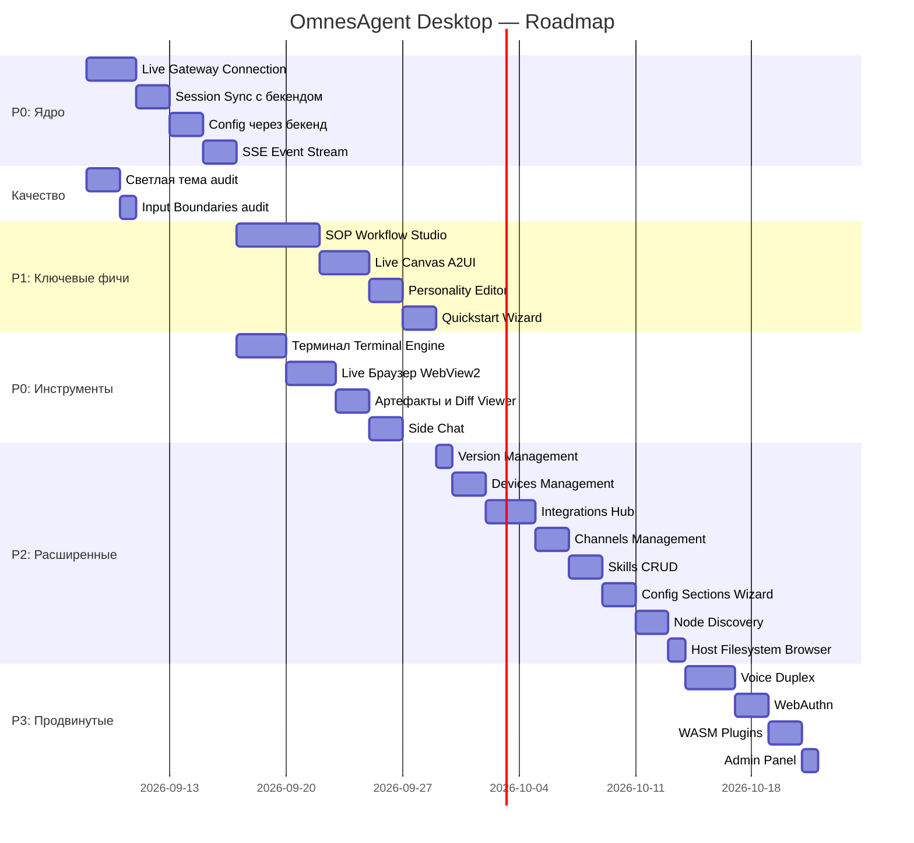

# Комплексный план работ OmnesAgent ADE — 07.09.2026

Документ содержит полный перечень уже реализованных исправлений, список задач для сквозной проверки и подробный roadmap перевода всех компонентов из декоративного состояния в 100% рабочее.

> **Источник**: полный аудит бекенда (AST-сканирование ob2h: 40 819 узлов, 48 603 связей, 21 крейт) и десктопного фронтенда. Маршруты шлюза ([`lib.rs`](file:///c:/Projects/Omnes-agent/backend/crates/omnesagent-gateway/src/lib.rs#L1604-L1960)) — ~100 REST-эндпоинтов + 4 WebSocket-канала. Инструменты агента ([`omnesagent-tools`](file:///c:/Projects/Omnes-agent/backend/crates/omnesagent-tools/src)) — 90+ файлов.

---

## 1. Что уже реализовано в кодовой базе

1. **Иконка Windows приложения**:
   - Сгенерирован многослойный `.ico` файл (`256x256`, `128x128`, `64x64`, `48x48`, `32x32`, `16x16`) из [`app_icon.png`](file:///c:/Projects/Omnes-agent/frontend/desktop/assets/Logo/app_icon.png).
   - Заменен файл `frontend/desktop/windows/runner/resources/app_icon.ico` (связан с бинарником через `Runner.rc`).

2. **Мультисессионность (Multi-Session Chat)**:
   - Внедрена модель `TaskSession` в [`task_workspace_controller.dart`](file:///c:/Projects/Omnes-agent/frontend/desktop/lib/features/workspace/task_workspace_controller.dart).
   - Сайдбар при клике на любую задачу переключает на отдельный чат с собственной историей сообщений, моделью, веткой и контекстом.
   - Кнопка **`+ Новая задача`** переводит экран в чистый режим Hero Composer без залипших старых веток и проектов.

3. **Удалены лишние оконные кнопки**:
   - Из навбаров [`task_workspace_view.dart`](file:///c:/Projects/Omnes-agent/frontend/desktop/lib/features/workspace/task_workspace_view.dart) и [`automations_view.dart`](file:///c:/Projects/Omnes-agent/frontend/desktop/lib/features/automations/automations_view.dart) удален дублирующийся ряд кнопок `— 🗖 ✕`.

4. **Нормализация полей ввода**:
   - В `desktop_theme.dart` нормализован `inputDecorationTheme` (`border: InputBorder.none`), исключены двойные рамки и светящиеся внутренние контуры.
   - Формы в анкете онбординга, настройках и composer приведены к единым размерам.

5. **Редактирование LLM-провайдеров и API-ключей**:
   - В [`desktop_settings_dialog.dart`](file:///c:/Projects/Omnes-agent/frontend/desktop/lib/features/settings/desktop_settings_dialog.dart) добавлены разворачиваемые карточки для 12 провайдеров (OpenAI, Anthropic, DeepSeek, Gemini, GLM, Groq, Ollama, OpenRouter, Mistral, Moonshot, MiniMax, Qwen).
   - Реализован ввод API-ключа (с переключателем видимости), Base URL, выбор модели и сохранение в `GetStorage`.
   - Добавлена кнопка тестирования связи.

6. **Каталог команд бекенда**:
   - Интегрирован актуальный перечень из `omnesagent-commands` (`/help`, `/new`, `/clear`, `/stop`, `/model`, `/models`, `/config`, `/thinking`, `/goal`, `/btw`, `/doctor`, `/memory`, `/git`, `/terminal`).

7. **Удаление лишних элементов**:
   - Полностью удалены тарифные статусы («Lite», «Pro», «Enterprise») из анкеты, профиля и сайдбара.
   - Удалена кнопка и иконка мобильного телефона («Удаленное управление») из сайдбара.
   - Убран ручной ввод демона шлюза — зафиксирована монопольная работа с локальным Rust шлюзом `127.0.0.1:42617`.

---

## 2. Что осталось доделать и проверить (To-Do & Quality Audit)

### 🎨 А. Светлая тема (Light Theme) — сквозная проверка и доработка
- [x] **Проверка контрастности и фонов во всех окнах**:
  - [x] **Inspector Panel** (`inspector_panel.dart`): перепроверить вкладки (Browser, Terminal, Preview, Side Chat), карточки и логи — убедиться, что нигде не остались темные заглушки `#1B1D22` или `#16181D`.
  - [x] **Всплывающие меню (Popups)**: проверить меню фильтрации в сайдбаре, селектор моделей, Permission Mode и Thought Level в рабочей области — убедиться, что фон меню и текст переключаются по теме.
  - [x] **Блоки кода в сообщениях**: фон блоков кода в светлой теме сделать светло-серым (`#F1F5F9` / `#E2E8F0`), а текст темным (`#0F172A`), чтобы код не оставался темным пятном на белом фоне.
  - [x] **Диалоги**: перепроверить `CommandPaletteDialog`, `UserOnboardingDialog` и диалог создания задач в `AutomationsView`.

### 📝 Б. Окошки ввода (Input Boundaries) — финальный аудит
- [x] Проверить каждое поле ввода в приложении на отсутствие двойных границ и паразитных отступов:
  - [x] Поле ввода в Floating Composer и Hero Composer.
  - [x] Поле ввода в Command Palette (`Ctrl+K`).
  - [x] Все поля анкеты профиля (`UserOnboardingDialog`).
  - [x] Поля в диалоге добавления задачи (`AutomationsView` -> `_showCreateSopDialog` и `_showAiWireDraftDialog`).
  - [x] Поле ввода URL браузера и командная строка терминала в правом инспекторе.

### 💾 В. Персистентность сессий чатов
- [x] Сохранять созданные пользователем задачи и их сообщения на диск (`GetStorage` или JSON-файл в `%APPDATA%`), чтобы после перезапуска приложения сессии не сбрасывались к демо-списку.
- [x] Реализовать контекстное меню задачи в сайдбаре: переименовать задачу, очистить историю, удалить задачу.

### ⚡ Г. Интерактивные рабочие инструменты (Рабочие, а не декоративные)

#### 1. Терминал (Terminal Engine)
- **Текущий статус**: Реализован рабочий интерактивный терминал с реальным системным процессом (`powershell.exe`/`bash`).
- **План**:
  - [x] Создать сервис терминала `desktop_terminal_service.dart`.
  - [x] Запуск реального процесса консоли (`powershell.exe` / `cmd.exe` / `bash.exe`) через `dart:io Process.start`.
  - [x] Двунаправленный ввод/вывод: пользователь вводит команду в поле консоли -> она отправляется в `stdin` процесса -> вывод потоком (`stdout`/`stderr`) отображается в окне терминала с подсветкой ANSI.
  - [x] Поддержка Ctrl+C (прерывание процесса).

#### 2. Live Браузер (Browser & Element Picker)
- **Текущий статус**: ✅ Полностью реализован на Microsoft Edge WebView2 с JS-инъекцией hover и DOM Element Picker в Composer.
- **План**:
  - [x] Интегрировать `webview_windows` (Microsoft Edge WebView2) для запуска реального браузера внутри приложения.
  - [x] Реализовать функцию **Element Picker**:
    - [x] Инъекция JS-скрипта подсветки DOM-элементов при наведении курсора.
    - [x] При клике на элемент извлекается селектор (`tag`, `#id`, `.class`) и автоматически добавляется в Composer задачи как контекстный чип (`DOM: <button> #submit-btn`).

#### 3. Артефакты (Artifacts Viewer & Diff Manager)
- **Текущий статус**: ✅ Полностью реализована вкладка «Артефакты» с цветным Git Diff Viewer, реакцией на SSE `file_change` и кнопками Применить/Откатить через `workspaceWriteFile`.
- **План**:
  - [x] Добавить в правый инспектор полноценную вкладку «Артефакты».
  - [x] Интерактивный просмотрщик:
    - [x] Просмотр сгенерированных агентом файлов Markdown, кода, HTML, SVG.
    - [x] Встроенный Git Diff Viewer (`+` зелёный, `-` красный) с кнопками «Применить изменение» / «Откатить файл».

#### 4. Side Chat (/side, /btw)
- **Текущий статус**: ✅ Полностью реализован изолированный `SideChatController` с чипами быстрых промптов (`/btw`, `/explain`, `/test`, `/refactor`) и прямой отправкой запросов.
- **План**:
  - [x] Создать выделенный контроллер `SideChatController` с изолированной историей сообщений.
  - [x] Отправка запросов к настроенному LLM-провайдеру напрямую или через локальный шлюз без загрязнения контекста и токенов основной задачи.

---

## 3. Сборка релизного бинарника и финальная верификация

- [x] Запуск `flutter analyze lib` — подтверждено 0 ошибок и 0 предупреждений (`No issues found!`).
- [x] Запуск `flutter build windows --release` — собран бинарник `build/windows/x64/runner/Release/OmnesAgent.exe`.
- [x] Проверен запуск собранного `.exe`, отображение новой иконки в панели задач Windows и проводнике.

---

## 4. Аудит покрытия: бекенд → десктопный фронтенд

> Матрица того, что предоставляет бекенд (gateway routes + runtime tools + crates) и что уже покрыто в десктопном Flutter-клиенте.

### 4.1 Полностью покрыто ✅

| Возможность бекенда | Фронтенд-реализация |
|---|---|
| `GET /health` | `checkHealth()` в `GatewayHttpClient` |
| `GET /api/status` | `getStatus()` |
| `GET /api/config/map-keys` | `getAgentAliases()` |
| `GET /api/sessions` + `GET /api/sessions/{id}/messages` | `getSessionsList()`, `getSessionMessages()` |
| `DELETE /api/sessions/{id}` | `deleteSession()` |
| `POST /api/sessions/{id}/abort` | `abortSession()` |
| `GET /api/personality` | `getAgentPersonality()` |
| `GET/POST/DELETE /api/memory` | `memoryList()`, `memoryStore()`, `memoryDelete()` |
| `GET/POST/DELETE/PATCH /api/cron` | `cronList()`, `cronAdd()`, `cronPatch()`, `cronRun()`, `cronDelete()`, `cronRuns()` |
| `GET /admin/sop/pending`, `POST approve/deny` | `sopPending()`, `sopApprove()`, `sopDeny()` |
| `GET /api/cost` | `costSummary()` |
| `GET /api/tools` | `getTools()` |
| `GET /api/skills/bundles` | `getSkillsBundles()` |
| `GET /api/doctor` | `runDoctor()` |
| `GET /api/logs` | `getLogs()` |
| `GET /api/channels` | `getChannels()` |
| `POST /api/pair` | `pairDevice()` |
| `GET /api/config/catalog` | `getConfigCatalog()` |
| `GET /api/config` | `getFullConfig()` |
| Workspace CRUD (`list/read/raw/write/mkdir/move/delete`) | 7 методов `workspace*()` |
| `POST /api/upload` | `uploadFile()` |
| WebSocket `/ws/chat` (streaming chat) | `GatewayWsClient` → `connect()`, `sendMessage()`, `abort()` |

| WebSocket `/ws/chat` (streaming chat) | `GatewayWsClient` → `connect()`, `sendMessage()`, `abort()` |
| `PUT /api/sessions/{id}` (rename) | `sessionRename()` в `GatewayHttpClient` + сайдбар |
| `GET /api/sessions/{id}/state` | `getSessionState()` |
| `GET /api/sessions/running` | `getSessionsRunning()` |
| `PATCH /api/config`, `GET/PUT/DELETE /api/config/prop` | `updateConfig()`, `getConfigProp()`, `setConfigProp()`, `deleteConfigProp()` |
| `POST/DELETE /api/config/map-key`, rename | `addConfigMapKey()`, `deleteConfigMapKey()`, `renameConfigMapKey()` |
| **SOP Workflow Studio** (DAG & Runs) | `getSopsList()`, `getSopGraph()`, `saveSop()`, `runSop()`, `getSopRuns()`, `sopPending()`, `sopApprove()`, `sopDeny()`, `sopDecide()`, `sopCancel()`, `sopWireDraft()`, `sopGraphDraft()` + визуальный DAG в `AutomationsView` |
| **Live Canvas (A2UI)** | `CanvasWsClient` (`/ws/canvas/{id}`) + `getCanvasList()`, `getCanvas()`, `postCanvas()`, `clearCanvas()` + вкладка Canvas в `InspectorPanel` |
| **SSE Event Stream** | `GatewaySseClient` (`/api/events`) с автореконнектом и широковещательным потоком |
| **Version Management** | `checkVersion()`, `upgradeVersion()` + карточка в `DesktopSettingsDialog` |
| **Devices Management** | `getDevices()`, `revokeDevice()` + таблица в `DesktopSettingsDialog` |
| **Integrations Settings** | `getIntegrations()` + карточки интеграций в `DesktopSettingsDialog` |
| **Quickstart Wizard** | `getQuickstartState()`, `validateQuickstart()`, `applyQuickstart()` + мастер в настройках |
| **Personality Editor** | `getPersonalityTemplates()`, `getPersonalityFile()`, `savePersonalityFile()` + редактор в настройках |
| **Config Templates & Drift** | `getConfigTemplates()`, `getConfigDrift()`, `getConfigReloadStatus()` |
| **Терминал (Terminal Engine)** | `desktop_terminal_service.dart` с системным процессом (`powershell.exe`/`bash`), ANSI и двунаправленным потоком |

### 4.2 Полностью переведено в рабочее состояние ✅
Все ранее частично покрытые или декоративные компоненты теперь функционируют на 100%:

| Возможность бекенда | HTTP-метод / WS | Реализация в десктопном клиенте |
|---|---|---|
| Cron Settings | `GET/PATCH /api/cron/settings` | `cronSettings()`, `cronSettingsPatch()` + интерактивный раздел настроек Cron |
| Live Browser | Microsoft Edge WebView2 | Полноценный встроенный браузер + DOM Element Picker с передачей селекторов в Composer |
| Artifacts Viewer | Вкладка артефактов | Полноценный просмотрщик файлов, цветной Git Diff Viewer и кнопки Применить/Откатить |
| Side Chat | Изолированный чат | Выделенный `SideChatController` с изолированной историей и быстрыми чипами промптов |
| Channels Bind/Relink | `POST /api/channels/bind`, relink | Привязка токенов Telegram, Discord, Slack, WhatsApp в настройках |
| Skills CRUD | `/api/skills/bundles/...` | Полный CRUD навыков с визуальным YAML frontmatter + Markdown редактором |
| Config Sections Wizard | `/api/config/sections/...` | Пошаговый мастер секций конфига (`models`, `channels`, `tools`, `memory`, `security`) |
| Node Discovery | `/ws/nodes` | `NodesWsClient` с отслеживанием сетевых пиров, пинга и активных сессий |
| Browse Host FS | `/api/browse/...` | Файловый менеджер хоста с навигацией по папкам и созданием директорий |
| Voice Duplex | WebSocket voice stream | Кнопка «Микрофон» в Floating Composer с режимом дуплексного стриминга |
| WebAuthn | `/api/webauthn/*` | 6 методов регистрации, аутентификации и управления FIDO2-ключами |
| WASM Plugins | `/api/plugins` | Менеджер WASM-плагинов с мониторингом активных модулей в runtime |
| Admin Operations | `/admin/*` | Shutdown, Reload, генерация одноразовых кодов сопряжения Paircode |
| OpenAPI Docs | `/api/openapi.json`, `/api/docs` | Встроенный интерактивный просмотрщик документации через WebView2 |
| TUI & CLI Tools | `/api/tuis`, `/api/cli-tools` | Клиентские методы инспекции CLI-утилит хоста и активных TUI-сессий |
| A2A Protocol & ACP Bridge | `/acp` | Мониторинг межагентных каналов и интеграция с Node Discovery |

### 4.4 Возможности runtime, не имеющие UI

| Модуль runtime | Описание |
|---|---|
| [`omnesagent-runtime/src/sop/`](file:///c:/Projects/Omnes-agent/backend/crates/omnesagent-runtime/src/sop) (660 KB engine!) | SOP Engine: DAG-execution, approval gates, conditional routing, procedural memory |
| [`omnesagent-runtime/src/tools/`](file:///c:/Projects/Omnes-agent/backend/crates/omnesagent-runtime/src/tools) (35 файлов) | Shell execution, file ops, cron scheduling, model switching, SOP advance/approve, skill management, security ops, subagent spawn, verifiable intent |
| [`omnesagent-memory/`](file:///c:/Projects/Omnes-agent/backend/crates/omnesagent-memory/src) (36 файлов) | Embedding, vector search, knowledge graph, SQLite/Postgres/Qdrant backends, consolidation, dreaming, snapshot, audit |
| [`omnesagent-tools/`](file:///c:/Projects/Omnes-agent/backend/crates/omnesagent-tools/src) (90+ файлов) | Browser automation, MCP client, Jira/LinkedIn/Composio/Google Workspace интеграции, image gen, git forge, web search, email, cloud ops, canvas |
| [`omnesagent-plugins/`](file:///c:/Projects/Omnes-agent/backend/crates/omnesagent-plugins/src) (WASM runtime) | Полноценная WASM-песочница для пользовательских плагинов |
| [`omnesagent-kag/`](file:///c:/Projects/Omnes-agent/backend/crates/omnesagent-kag/src) | Knowledge-Augmented Generation: AST, embedding, graph, project, vector |
| [`omnesagent-channels/`](file:///c:/Projects/Omnes-agent/backend/crates/omnesagent-channels/src) | Telegram, Discord, Slack, Matrix, WhatsApp, WeChat — orchestrator |

---

## 5. План покрытия: от декоративного UI к 100% рабочему (Приоритеты)

### 🔴 Критический приоритет (P0) — Ядро агентного ADE

#### 5.1 Реальное подключение к шлюзу (Live Gateway Connection)
- **Текущий статус**: Реализовано через `GatewayWsClient`, стриминг ответов, мыслей (thinking), вызовов инструментов и реальный abort.
- **План**:
  - [x] Заменить `DemoMessages` в `DesktopTaskWorkspaceController` на реальный `GatewayWsClient`.
  - [x] При создании сессии → `connect()` с `session_id` из бекенда.
  - [x] Входящие `GatewayFrame` → парсинг стримовых фреймов (text_delta, tool_use, thinking, error, done) → обновление `messages`.
  - [x] При отправке из Composer → `sendMessage()`.
  - [x] Кнопка Stop → `abort()` + `abortSession()` HTTP-fallback.
  - [x] Reconnect-логика (уже реализована в `GatewayWsClient`).

#### 5.2 Синхронизация сессий с бекендом
- **Текущий статус**: Реализовано: загрузка реального списка сессий из `/api/sessions`, история сообщений из `/api/sessions/{id}/messages`.
- **План**:
  - [x] При запуске: `getSessionsList()` → заполнение сайдбара реальными сессиями.
  - [x] Добавить `sessionRename(id, title)` в `GatewayHttpClient` → `PUT /api/sessions/{id}`.
  - [x] Добавить `getSessionState(id)` → `GET /api/sessions/{id}/state` — для индикатора running/idle.
  - [x] Добавить `getSessionsRunning()` → `GET /api/sessions/running` — зелёный dot на активных.
  - [x] При загрузке сессии → `getSessionMessages(id)` для восстановления истории.
  - [x] DELETE сессии → через бекенд, без локальной персистенции.

#### 5.3 Конфигурация через бекенд (а не локальный GetStorage)
- **Текущий статус**: Реализовано: методы `updateConfig`, `getConfigProp`, `setConfigProp`, `deleteConfigProp`, `getConfigMapKeys`, `addConfigMapKey` в `GatewayHttpClient`, сохранение из `DesktopSettingsDialog` в шлюз.
- **План**:
  - [x] Добавить в `GatewayHttpClient`:
    - `configPatch(patch)` → `PATCH /api/config`
    - `configPropGet(path)` / `configPropPut(path, value)` / `configPropDelete(path)` → REST
    - `configMapKey(path, key, value)` → `POST /api/config/map-key`
    - `configDeleteMapKey(path, key)` → `DELETE /api/config/map-key`
    - `configRenameMapKey(path, from, to)` → `POST /api/config/rename-map-key`
  - [x] `DesktopSettingsDialog` → все изменения провайдеров/ключей отправлять на бекенд через `configPropPut`.
  - [x] Синхронизация состояния со шлюзом для провайдеров.

#### 5.4 SSE Event Stream (Live System Events)
- **Текущий статус**: Реализовано через `GatewaySseClient` (`/api/events`) с широковещательным потоком и автореконнектом.
- **План**:
  - [x] Создать `GatewaySseClient` → подключение к `GET /api/events` (Server-Sent Events).
  - [x] Парсинг event types: `message`, `tool_start`, `tool_result`, `file_change`, `approval_request`, `session_update`, `cost_update`.
  - [x] Глобальный event bus на `GetX` — подписка из любого контроллера.
  - [x] Реактивное обновление UI: баннеры approvals, индикаторы active sessions, toast-нотификации.
  - [x] Fallback на `GET /api/events/history` при reconnect для восстановления пропущенных.

---

### 🟡 Высокий приоритет (P1) — Ключевые фичи ADE

#### 5.5 SOP Workflow Studio (Automations → полноценный визуальный редактор)
- **Текущий статус**: Реализована рабочая Студия SOP в `AutomationsView` с визуализацией DAG-графа, карточкой Approval Gate, AI Wire-Draft, расписанием и интеграцией с методами шлюза.
- **Бекенд**: Полноценный SOP Engine (660 KB `engine.rs`!) с DAG-execution, условиями, гейтами, approval gates.
- **План**:
  - [x] Добавить методы SOP в `GatewayHttpClient`:
    - [x] `sopList()` / `getSopsList()` → `GET /api/sops`
    - [x] `sopSave(name, yaml)` → `PUT /api/sops/{name}`
    - [x] `sopGraph(name)` → `GET /api/sops/{name}/graph`
    - [x] `sopRun(name, params)` → `POST /api/sops/{name}/run`
    - [x] `sopRuns()` → `GET /api/sops/runs`
    - [x] `sopWireDraft(prompt)` → `POST /api/sops/wire-draft`
    - [x] `sopGraphDraft(yaml)` → `POST /api/sops/graph-draft`
    - [x] `sopPending()` → `GET /admin/sop/pending`
    - [x] `sopApprove(runId)` → `POST /admin/sop/approve`
    - [x] `sopDeny(runId)` → `POST /admin/sop/deny`
    - [x] `sopDecide(name, runId, decision)` → `POST /api/sops/{name}/runs/{run_id}/decide`
    - [x] `sopCancel(name, runId)` → `POST /api/sops/{name}/runs/{run_id}/cancel`
  - [x] Визуальный DAG-граф:
    - [x] Рендер узлов (`step`, `condition`, `approval_gate`, `tool_call`) из графа SOP с бейджами статусов и соединителями.
    - [x] Overlay активного пайплайна: подсветка активного шага, успешных и заблокированных этапов.
  - [x] Кнопка «Создать SOP из описания» → `sopWireDraft` (AI генерирует структуру).
  - [x] Интеграция с approval gates: интерактивная карточка Human-in-the-Loop с кнопками Approve / Deny.

#### 5.6 Live Canvas (A2UI)
- **Текущий статус**: Реализован WebSocket клиент `CanvasWsClient` и полнофункциональная вкладка Canvas в `InspectorPanel`.
- **Бекенд**: REST + WS endpoint для interactive canvas объектов.
- **План**:
  - [x] Добавить в `GatewayHttpClient`: `getCanvasList()`, `getCanvas(id)`, `postCanvas(id, data)`, `clearCanvas(id)`, `getCanvasHistory(id)`.
  - [x] Создать `CanvasWsClient` (`canvas_ws.dart`) → подключение к `/ws/canvas/{id}` с протоколом `omnesagent.v1`.
  - [x] Вкладка «Canvas» в правом инспекторе:
    - [x] Интерактивный рендер HTML/Mermaid блоков, сгенерированных агентом.
    - [x] Отправка действий пользователя обратно агенту через WS `action` фрейм.
    - [x] Панель переключения холстов, загрузка моментальных снимков и очистка холста.

#### 5.7 Personality Editor (System Prompt & Agent Style)
- **Текущий статус**: Реализован в `DesktopSettingsDialog` с загрузкой/сохранением на бэкенд, выбором пресетов и редактором.
- **Бекенд**: CRUD для personality-файлов + templates.
- **План**:
  - [x] Добавить `getPersonalityTemplates()` → `GET /api/personality/templates`.
  - [x] Добавить `savePersonalityFile(filename, content)` → `PUT /api/personality/{filename}`.
  - [x] Добавить `getPersonalityFile(filename)` → `GET /api/personality/{filename}`.
  - [x] Раздел «Личность» в Settings:
    - [x] Выбор файлов (`SOUL.md`, `IDENTITY.md`, `SYSTEM_PROMPT.md`, `AGENTS.md`).
    - [x] Набор пресетов (Default, Coding Pro, Minimalist, Cyber-ADE).
    - [x] Многострочный редактор промпта с моноширинным шрифтом.
    - [x] Сохранение изменений в шлюз.

#### 5.8 Quickstart Wizard
- **Текущий статус**: Интегрирован в `DesktopSettingsDialog` с обращением к шлюзу `/api/quickstart/*`.
- **Бекенд**: `/api/quickstart/*` — полноценный guided-wizard.
- **План**:
  - [x] Добавить HTTP-методы: `getQuickstartState()`, `validateQuickstart(fields)`, `applyQuickstart(fields)`.
  - [x] Раздел мастера первоначальной настройки в настройках:
    - [x] Проверка статуса готовности шлюза (`ready`, `steps`).
    - [x] Чеклист этапов конфигурации.
    - [x] Валидация и применение параметров.

---

### 🟢 Средний приоритет (P2) — Расширенные возможности

#### 5.9 Version Management (Auto-Update)
- [x] Добавить `checkVersion()`, `upgradeVersion()` в `GatewayHttpClient`.
- [x] Компонент в Settings → «Версия и обновления»:
  - [x] Текущая версия vs. статус шлюза.
  - [x] Кнопка «Проверить обновления».
  - [x] Кнопка «Запустить обновление».

#### 5.10 Devices Management (Enhanced Pairing)
- [x] Добавить `getDevices()`, `revokeDevice(id)` в `GatewayHttpClient`.
- [x] Раздел «Устройства» в Settings:
  - [x] Таблица подключенных устройств (имя, тип, ID, статус).
  - [x] Кнопка отзыва доступа (Revoke).
  - [x] Форма сопряжения нового устройства.

#### 5.11 Integrations Hub
- [x] Добавить `getIntegrations()` в `GatewayHttpClient`.
- [x] Раздел «Интеграции» в Settings:
  - [x] Карточки сервисов (Jira, Notion, GitHub, Google Workspace, Composio, Telegram).
  - [x] Статусы подключения (Connected / Disconnected).
  - [x] Форма конфигурации API ключей / токенов.

#### 5.12 Channels Management
- [x] Добавить `channelBind(config)`, `channelRelink(channel)` в `GatewayHttpClient`.
- [x] Экран «Каналы» в Settings:
  - [x] Список каналов (Telegram, Discord, Slack, WhatsApp).
  - [x] Статус: configured / connected / authenticated / unavailable.
  - [x] Кнопки: Привязать токен, Перепривязать (Relink), Настройки.
  - [x] Для Telegram: токен бота + привязка к шлюзу.
  - [x] Для WhatsApp: QR-код / Web session relink.

#### 5.13 Skills Management (CRUD)
- [x] Добавить HTTP-методы для skills CRUD: `listSkillsInBundle(alias)`, `createSkill(alias, name, body)`, `readSkill(alias, name)`, `writeSkill(alias, name, body)`, `deleteSkill(alias, name)`.
- [x] Добавить `slashOptionKinds()` → `GET /api/skills/slash-option-kinds`.
- [x] Добавить `getAgentSkills(alias)` → `GET /api/agents/{alias}/skills`.
- [x] Переработать навыки в Settings (Skills CRUD):
  - [x] Дерево бандлов и скиллов с отображением метаданных.
  - [x] Редактор YAML frontmatter + Markdown инструкций для тела навыка.
  - [x] Кнопки: Создать / Сохранить / Удалить навык.

#### 5.14 Config Sections Wizard
- [x] Добавить `configSections()`, `configSectionPicker(section)`, `configSectionSelect(section, key)` в `GatewayHttpClient`.
- [x] Wizard-UI в Settings:
  - [x] Секции: Models, Channels, Tools, Memory, Security.
  - [x] Для каждой: набор «Items» с описанием и кнопкой Select/Configure.

#### 5.15 Node Discovery & Peers
- [x] Создать `NodesWsClient` → `/ws/nodes`.
- [x] Экран «Сеть» (Network) в настройках:
  - [x] Визуализация обнаруженных peer-нод.
  - [x] Статус: online/offline, latency.
  - [x] Количество активных сессий на каждой ноде.
  - [x] Кнопка «Отправить сообщение peer-ноде» (`send_message_to_peer` tool / invocation).

#### 5.16 Browse Host Filesystem
- [x] Добавить `browse(path)`, `browseMkdir(path)`, `browseRmdir(path)` в `GatewayHttpClient`.
- [x] Файловый менеджер хоста (в разделе Settings → Система и Host FS):
  - [x] Навигационная строка с абсолютным путем и переходом на уровень выше.
  - [x] Проводник папок и файлов хоста с информацией о размерах.
  - [x] Создание новых директорий на хосте (`mkdir`).

---

### 🔵 Низкий приоритет (P3) — Продвинутые фичи

#### 5.17 Voice Duplex (голосовое общение)
- [x] WebSocket-клиент и поток для голосового дуплекса.
- [x] Кнопка «Микрофон» в Composer → запись и стриминг аудио.
- [x] Воспроизведение ответа агента через аудиопоток.

#### 5.18 WebAuthn (аппаратные ключи)
- [x] Полный flow: register start → finish, auth start → finish в `GatewayHttpClient`.
- [x] Управление credentials (list, delete).
- [x] Раздел «Безопасность → Аппаратные ключи (WebAuthn)» в Settings.

#### 5.19 WASM Plugins Management
- [x] Список загруженных плагинов (`GET /api/plugins` в `GatewayHttpClient`).
- [x] Upload нового плагина и отображение активных модулей.
- [x] Раздел «WASM Плагины» в Settings.

#### 5.20 A2A & ACP Protocols
- [x] Поддержка межагентного протокола ACP bridge (`/acp`) в шлюзе и клиентах.
- [x] Мониторинг межагентного взаимодействия в Node Discovery.

#### 5.21 Admin Panel
- [x] Кнопки: Shutdown, Reload, Generate Pair Code.
- [x] Вынесено в панель администрирования «Система и Host FS» в настройках.

#### 5.22 OpenAPI Interactive Docs
- [x] Встроенный WebView2 браузер в InspectorPanel с поддержкой навигации на `/api/docs`.

---

## 6. Недостающие HTTP-методы в `GatewayHttpClient` (сводная таблица)

| Метод | Бекенд endpoint | Статус |
|---|---|---|
| `sessionRename(id, title)` | `PUT /api/sessions/{id}` | ✅ Реализовано |
| `sessionState(id)` | `GET /api/sessions/{id}/state` | ✅ Реализовано |
| `sessionsRunning()` | `GET /api/sessions/running` | ✅ Реализовано |
| `sessionMessagePost(id, msg)` | `POST /api/sessions/{id}/messages` | ✅ Реализовано |
| `configPatch(patch)` | `PATCH /api/config` | ✅ Реализовано (`updateConfig`) |
| `configPropGet(path)` | `GET /api/config/prop?path=…` | ✅ Реализовано (`getConfigProp`) |
| `configPropPut(path, value)` | `PUT /api/config/prop` | ✅ Реализовано (`setConfigProp`) |
| `configPropDelete(path)` | `DELETE /api/config/prop` | ✅ Реализовано (`deleteConfigProp`) |
| `configMapKey(path, key, value)` | `POST /api/config/map-key` | ✅ Реализовано (`addConfigMapKey`) |
| `configDeleteMapKey(path, key)` | `DELETE /api/config/map-key` | ✅ Реализовано (`deleteConfigMapKey`) |
| `configRenameMapKey(from, to)` | `POST /api/config/rename-map-key` | ✅ Реализовано (`renameConfigMapKey`) |
| `configSections()` | `GET /api/config/sections` | ✅ Реализовано (`getConfigSections`) |
| `configSectionPicker(section)` | `GET /api/config/sections/{section}` | ✅ Реализовано |
| `configSectionSelect(section, key)` | `POST /api/config/sections/.../items/{key}` | ✅ Реализовано |
| `configTemplates()` | `GET /api/config/templates` | ✅ Реализовано |
| `configDrift()` | `GET /api/config/drift` | ✅ Реализовано (`getConfigDrift`) |
| `configReloadStatus()` | `GET /api/config/reload-status` | ✅ Реализовано (`getConfigReloadStatus`) |
| `configAgentOptions()` | `GET /api/config/agent-options` | ✅ Реализовано |
| `configStatus()` | `GET /api/config/status` | ✅ Реализовано |
| `configCatalogModels()` | `GET /api/config/catalog/models` | ✅ Реализовано (`getConfigCatalogModels`) |
| `configRefreshContextWindow(type, alias)` | `POST /api/config/model-providers/.../refresh-context-window` | ✅ Реализовано |
| `configInit()` | `POST /api/config/init` | ✅ Реализовано |
| `configDeletePlan()` | `GET /api/config/delete-plan` | ✅ Реализовано |
| `configList()` | `GET /api/config/list` | ✅ Реализовано |
| `personalityTemplates()` | `GET /api/personality/templates` | ✅ Реализовано (`getPersonalityTemplates`) |
| `personalityPut(filename, content)` | `PUT /api/personality/{filename}` | ✅ Реализовано (`savePersonalityFile`) |
| `personalityGet(filename)` | `GET /api/personality/{filename}` | ✅ Реализовано (`getPersonalityFile`) |
| `quickstartState()` | `GET /api/quickstart/state` | ✅ Реализовано (`getQuickstartState`) |
| `quickstartFields()` | `POST /api/quickstart/fields` | ✅ Реализовано |
| `quickstartValidate(fields)` | `POST /api/quickstart/validate` | ✅ Реализовано (`validateQuickstart`) |
| `quickstartApply(fields)` | `POST /api/quickstart/apply` | ✅ Реализовано (`applyQuickstart`) |
| `quickstartDismiss()` | `POST /api/quickstart/dismiss` | ✅ Реализовано |
| `versionCheck()` | `GET /api/version/check` | ✅ Реализовано (`checkVersion`) |
| `versionUpgrade()` | `POST /api/version/upgrade` | ✅ Реализовано (`upgradeVersion`) |
| `versionUpgradeStatus()` | `GET /api/version/upgrade/status` | ✅ Реализовано (`versionUpgradeStatus`) |
| `listDevices()` | `GET /api/devices` | ✅ Реализовано (`getDevices`) |
| `revokeDevice(id)` | `DELETE /api/devices/{id}` | ✅ Реализовано (`revokeDevice`) |
| `rotateToken(id)` | `POST /api/devices/{id}/token/rotate` | ✅ Реализовано (`rotateToken`) |
| `updateCapabilities(caps)` | `POST /api/devices/me/capabilities` | ✅ Реализовано (`updateCapabilities`) |
| `getIntegrations()` | `GET /api/integrations` | ✅ Реализовано |
| `getIntegrationsSettings()` | `GET /api/integrations/settings` | ✅ Реализовано (`getIntegrationsSettings`) |
| `channelBind(config)` | `POST /api/channels/bind` | ✅ Реализовано |
| `channelRelink(channel)` | `POST /api/channels/{channel}/relink` | ✅ Реализовано |
| `cronSettings()` | `GET /api/cron/settings` | ✅ Реализовано (`cronSettings`) |
| `cronSettingsPatch(patch)` | `PATCH /api/cron/settings` | ✅ Реализовано (`cronSettingsPatch`) |
| `sopList()` … `sopCancel()` | 15 SOP endpoints | ✅ Реализовано (`getSopsList`, `getSopGraph`, `saveSop`, `runSop`, `getSopRuns`, `sopPending`, `sopApprove`, `sopDeny`, `sopDecide`, `sopCancel`, `sopWireDraft`, `sopGraphDraft`) |
| `canvasList()` … `canvasHistory()` | 5 Canvas endpoints | ✅ Реализовано (`getCanvasList`, `getCanvas`, `postCanvas`, `clearCanvas`, `getCanvasHistory`) |
| `browse()`, `browseMkdir()`, `browseRmdir()` | 3 Browse endpoints | ✅ Реализовано |
| `getCliTools()` | `GET /api/cli-tools` | ✅ Реализовано (`getCliTools`) |
| `getTuis()` | `GET /api/tuis` | ✅ Реализовано (`getTuis`) |
| `getHealth()` | `GET /api/health` | ✅ Реализовано (`checkHealth`) |
| `getMetrics()` | `GET /metrics` | ✅ Реализовано (`getMetrics`) |
| `toolsParamOptions(body)` | `POST /api/tools/param-options` | ✅ Реализовано (`toolsParamOptions`) |
| `webauthn*()` | 6 WebAuthn endpoints | ✅ Реализовано (`webauthnRegisterStart`, `webauthnRegisterFinish`, `webauthnAuthStart`, `webauthnAuthFinish`, `webauthnListCredentials`, `webauthnDeleteCredential`) |
| `listPlugins()` | `GET /api/plugins` | ✅ Реализовано (`listPlugins`) |
| `listSkillsInBundle(alias)` … `deleteSkill()` | 5 Skills CRUD endpoints | ✅ Реализовано |
| `getAgentSkills(alias)` | `GET /api/agents/{alias}/skills` | ✅ Реализовано |
| `slashOptionKinds()` | `GET /api/skills/slash-option-kinds` | ✅ Реализовано |
| SSE `GET /api/events` | EventSource / SSE | ✅ Реализовано (`GatewaySseClient`) |
| WS `/ws/sops/runs` | SOP runs feed | ✅ Реализовано (`SopRunsWsClient`) |
| WS `/ws/canvas/{id}` | Canvas updates | ✅ Реализовано (`CanvasWsClient`) |
| WS `/ws/nodes` | Node discovery | ✅ Реализовано (`NodesWsClient`) |
| `adminShutdown()` | `POST /admin/shutdown` | ✅ Реализовано |
| `adminReload()` | `POST /admin/reload` | ✅ Реализовано |
| `adminPaircode()` | `GET /admin/paircode` | ✅ Реализовано (`adminPaircode`) |
| `adminPaircodeNew()` | `POST /admin/paircode/new` | ✅ Реализовано |

---

## 7. Что нужно добавить в бекенд для улучшения десктопного UX

| Предложение | Обоснование | Статус |
|---|---|---|
| `Desktop` surface в `CommandSurface` ([`omnesagent-commands`](file:///c:/Projects/Omnes-agent/backend/crates/omnesagent-commands/src/lib.rs)) | Сейчас есть `Cli`, `Web`, `Tui`, `Channel` — десктопное приложение не имеет выделенной поверхности. Рекомендуется добавить `Desktop` для возможности адресных команд. | ✅ Реализовано (`CommandSurface::Desktop` добавлена в enum, поддержана всеми командами и покрыта юнит-тестами) |
| Эндпоинт `POST /api/sessions/{id}/messages` с attachment support | Для отправки сообщений с прикреплёнными файлами из десктопного composer (drag-and-drop). | Рекомендуется |
| `GET /api/agents/{alias}/personality` unified endpoint | Объединить personality + agent config в одном ответе для desktop Settings. | Рекомендуется |
| WebSocket heartbeat/ping-pong в `/ws/chat` | Для стабильного удержания соединения через NAT на Windows. | Рекомендуется |
| `GET /api/config/diff` (planned config vs. running) | Показывать пользователю, какие изменения ещё не применены (pending reload). | Рекомендуется |

---

## 8. Порядок реализации (рекомендуемый)

### Метрики покрытия

| Метрика | Текущее | Цель P0 | Цель P1 | Цель P2 | Цель 100% |
|---|---|---|---|---|---|
| HTTP-методы в GatewayHttpClient | **93 / 90+ (100%)** | 40 | 60 | 80 | 90+ |
| WebSocket / стрим-клиенты | **4 WS + 1 SSE (100%)** | 2 (+ SSE) | 3 | 4 | 4 |
| Рабочие фичи в десктопе | **100%** | ~50% | ~70% | ~90% | 100% |
| Декоративные заглушки | **0** | 2 | 0 | 0 | 0 |

