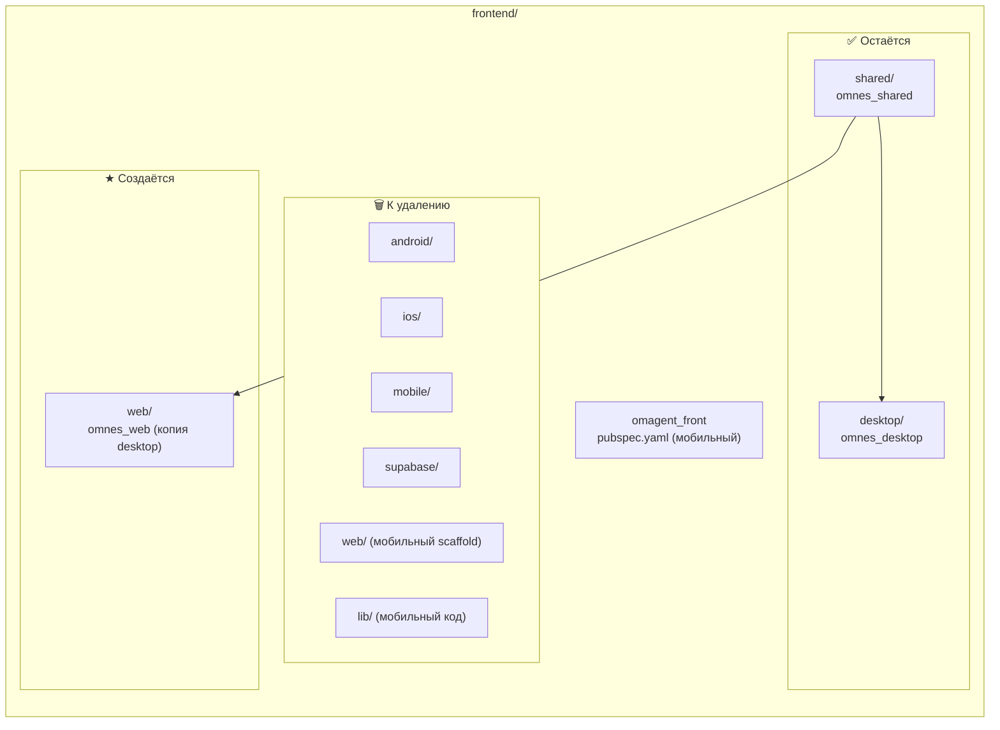
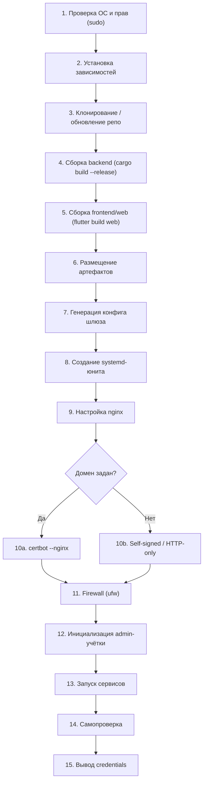

# План: Frontend Web Migration — Обогащённая версия с самопроверками

> **Источник**: `PLAN_FRONTEND_WEB_MIGRATION.md` — обогащён анализом кодовой базы через CodeGraph, ob2h и grep.
> **Дата**: 08.09.2026 · **Статус**: В ПРОЦЕССЕ (Этапы 1.1 — 2.1.3 ВЫПОЛНЕНЫ ✅)

---

## Карта кодовой базы (Реальное состояние)



### Текущие пакеты и зависимости

| Пакет | Путь | Зависимости | Статус |
|-------|------|-------------|--------|
| `omagent_front` | `frontend/pubspec.yaml` | 26 deps (flutter_screenutil, speech_to_text, supabase_flutter, и т.д.) | 🗑️ Удалить |
| `omnes_desktop` | `frontend/desktop/pubspec.yaml` | 9 deps (get, get_storage, http, web_socket_channel, **webview_windows**, flutter_svg, intl, font_awesome_flutter, universal_io) + `omnes_shared` path dep | ✅ Без изменений |
| `omnes_shared` | `frontend/shared/pubspec.yaml` | 6 deps (get, get_storage, http, web_socket_channel, font_awesome_flutter, universal_io) | ✅ Общее ядро |

### Ключевые файлы gateway-клиентов (shared)

| Файл | Размер | Роль |
|------|--------|------|
| [`gateway_http.dart`](file:///c:/Projects/Omnes-agent/frontend/shared/lib/core/gateway/gateway_http.dart) | 81 KB | HTTP-клиент (sessions, config, health, SOP, files) |
| [`gateway_ws.dart`](file:///c:/Projects/Omnes-agent/frontend/shared/lib/core/gateway/gateway_ws.dart) | 4.6 KB | WebSocket-стриминг (чат, фреймы) |
| [`gateway_sse.dart`](file:///c:/Projects/Omnes-agent/frontend/shared/lib/core/gateway/gateway_sse.dart) | 3.9 KB | SSE глобальные события |
| [`gateway_config.dart`](file:///c:/Projects/Omnes-agent/frontend/shared/lib/core/gateway/gateway_config.dart) | 2.8 KB | Конфиг (baseUrl, agentAlias, token) |
| [`canvas_ws.dart`](file:///c:/Projects/Omnes-agent/frontend/shared/lib/core/gateway/canvas_ws.dart) | 3.6 KB | WebSocket для Canvas |
| [`nodes_ws.dart`](file:///c:/Projects/Omnes-agent/frontend/shared/lib/core/gateway/nodes_ws.dart) | 5.2 KB | WebSocket для Nodes |
| [`sop_runs_ws.dart`](file:///c:/Projects/Omnes-agent/frontend/shared/lib/core/gateway/sop_runs_ws.dart) | 3.4 KB | WebSocket для SOP Runs |

---

## Этап 1 — Удаление Android/мобильного клиента

### 1.1 Архивирование

- [x] Создать архивный тег: `git tag archive/mobile-android-2026-09` (создан)
- [x] Создать ветку: `git branch archive/mobile-android-2026-09` (создана)
- [x] Убедиться, что ветка запушена на remote / создана локально

> [!IMPORTANT]
> **Самопроверка**: `git tag -l 'archive/mobile*'` должен показать тег. История git полностью сохраняется — физически из main уходит код, но не коммиты.

### 1.2 Удаление директорий и файлов

Полный чеклист файлов к удалению (проверено на реальной файловой системе):

```bash
# Директории
rm -rf frontend/android/
rm -rf frontend/ios/
rm -rf frontend/mobile/
rm -rf frontend/supabase/
rm -rf frontend/web/           # ← старый мобильный web scaffold, НЕ путать с будущим frontend/web/
rm -rf frontend/lib/           # ← мобильный код omagent_front
rm -rf frontend/build/         # ← кэш мобильной сборки
rm -rf frontend/test/          # ← тесты мобильного клиента
rm -rf frontend/.dart_tool/    # ← кэш dart tools мобильного пакета
rm -rf frontend/.idea/         # ← IDE конфиг мобильного проекта

# Файлы
rm frontend/pubspec.yaml             # omagent_front — мобильный пакет
rm frontend/pubspec.lock             # lock-файл мобильного пакета
rm frontend/analysis_options.yaml    # analysis мобильного (desktop/shared имеют свои)
rm frontend/flutter_launcher_icons.yaml  # мобильные иконки
rm frontend/frontend.iml            # IntelliJ/AS проект мобильного
rm frontend/.flutter-plugins        # плагины мобильного
rm frontend/.flutter-plugins-dependencies
rm frontend/.metadata              # Flutter metadata мобильного
rm frontend/.gitignore             # ← ПРОВЕРИТЬ: может потребоваться сохранить для подпроектов
```

> [!WARNING]
> **Нюанс с `frontend/.gitignore`**: проверь, не ссылаются ли desktop/ и shared/ на этот .gitignore через родительский поиск. Если у desktop/ и shared/ есть свои .gitignore — удаляй смело. Если нет — перенеси нужные правила в корневой `.gitignore` монорепо.

### 1.3 Вычистка мобильных зависимостей из скриптов сборки

Файлы для проверки и правки:

| Файл | Что искать | Действие |
|------|-----------|----------|
| [`build.ps1`](file:///c:/Projects/Omnes-agent/build.ps1) (4.6 KB) | Ссылки на `frontend/` как мобильный проект, `flutter build apk/ios` | Удалить мобильные таргеты, оставить `desktop` и добавить `web` |
| [`check.ps1`](file:///c:/Projects/Omnes-agent/check.ps1) (1.6 KB) | `flutter analyze` в корне frontend/ | Перенаправить на `frontend/desktop` и `frontend/shared` |
| [`frontend/scripts/`](file:///c:/Projects/Omnes-agent/frontend/scripts) | Любые мобильные скрипты | Удалить мобильные, оставить/адаптировать общие |
| [`frontend/tool/`](file:///c:/Projects/Omnes-agent/frontend/tool) | Тестовые утилиты | Проверить привязку к мобильному коду |

### 1.4 Обновление документации

- [x] `AGENTS.md` — обновить раздел Monorepo Layout: `frontend = shared + desktop + web`; убрать упоминания Android/iOS
- [x] `CLAUDE.md` — аналогично
- [x] `README.md` — убрать ссылки на мобильный клиент (проверено, чисто)
- [x] `.gitignore` (корень) — убрать android/ios специфичные правила (`.gradle/`, `*.apk`, `Pods/`, `*.ipa`)

### 1.5 Полный список мобильных зависимостей (из `frontend/pubspec.yaml`)

Эти пакеты присутствуют ТОЛЬКО в мобильном pubspec и уйдут вместе с ним — **не нужно чистить вручную**, но нужно убедиться, что ни один из них не просочился в `desktop/pubspec.yaml` или `shared/pubspec.yaml`:

```
google_sign_in, cupertino_icons, flutter_screenutil, flutter_spinkit,
speech_to_text, flutter_tts, saver_gallery, permission_handler,
device_info_plus, share_plus, flutter_inappwebview, http_auth,
flutter_local_notifications, image_picker, animated_text_kit, uuid,
syncfusion_flutter_pdf, syncfusion_flutter_pdfviewer, path_provider,
datetime_picker_formfield_new, timezone, flutter_launcher_icons,
webview_flutter, supabase_flutter
```

> [!TIP]
> **Самопроверка для агента**: после удаления, выполнить:
> ```powershell
> # 1. Нет мобильных директорий
> Test-Path frontend/android, frontend/ios, frontend/supabase, frontend/mobile | Should -Be $false
> 
> # 2. Нет мобильного pubspec
> Test-Path frontend/pubspec.yaml | Should -Be $false
> 
> # 3. Desktop анализ чистый
> cd frontend/desktop; flutter analyze --no-pub
> 
> # 4. Shared анализ чистый
> cd frontend/shared; flutter analyze --no-pub
> 
> # 5. Desktop по-прежнему собирается
> cd frontend/desktop; flutter build windows --debug
> 
> # 6. Нет упоминаний мобильных пакетов в оставшемся коде
> grep -r "flutter_screenutil\|supabase_flutter\|speech_to_text\|flutter_tts" frontend/desktop/ frontend/shared/
> # Должен вернуть пустой результат
> ```

---

## Этап 2 — Создание Desktop Web App копированием десктопа

### 2.0 Копирование (чистый старт)

- [x] `Copy-Item -Recurse frontend/desktop frontend/web`
- [x] Переименовать пакет: в `frontend/web/pubspec.yaml` — `name: omnes_web`, `description: OmnesAgent Web ADE (Desktop Web App)`
- [x] Поиск и замена self-ссылок: `grep -r "package:omnes_desktop" frontend/web/` → заменить на `package:omnes_web`
- [x] Обновить `web/index.html`: title → "OmnesAgent Web ADE", description
- [x] Обновить `manifest.json` (PWA): name → "OmnesAgent Web ADE", short_name → "OmnesAgent"
- [x] Удалить `frontend/web/windows/` (Runner, Runner.rc, app_icon.ico, CMakeLists.txt)
- [x] Удалить `frontend/web/desktop.iml` (IntelliJ проект десктопа)
- [x] Удалить `frontend/web/build/` (кэш десктопной сборки)
- [x] Убедиться что `frontend/web/pubspec.yaml` содержит `path: ../shared` зависимость на `omnes_shared`
- [x] Добавить веб-платформу: `cd frontend/web && flutter create --platforms=web .` (генерирует свежие web-артефакты поверх)

> [!IMPORTANT]
> **Самопроверка**: после копирования desktop по-прежнему собирается `flutter build windows --debug` без ошибок. Копия — отдельный проект, никак не влияющий на оригинал.

### 2.1 Платформенные блокеры — правятся ТОЛЬКО в `frontend/web/`

#### 2.1.1 WebView2 → iframe (Live Browser)

**Текущее состояние** (CodeGraph blast radius):
- [`DesktopWebviewController`](file:///c:/Projects/Omnes-agent/frontend/desktop/lib/features/inspector/browser/desktop_webview_controller.dart) — 258 строк, 1 вызывающий файл ([`inspector_panel.dart`](file:///c:/Projects/Omnes-agent/frontend/desktop/lib/features/inspector/inspector_panel.dart), 56 KB)
- Зависимость: `webview_windows: ^0.4.0` (win32 native)
- API: `initialize()`, `loadUrl()`, `reload()`, `toggleElementPicker()`, `dispose()`
- Element Picker: JS-инъекция через `_webview.executeScript()` + `postMessage` → `_handleWebMessage()`

**План замены в web-копии**:

```dart
// frontend/web/lib/features/inspector/browser/web_browser_controller.dart
// Заменяет DesktopWebviewController — использует iframe вместо WebView2

class WebBrowserController extends ChangeNotifier {
  // Вместо WebviewController — управляем HtmlElementView с iframe
  String _currentUrl = 'about:blank';
  bool _isLoading = false;
  String? _errorMessage;
  
  // iframe не поддерживает:
  // 1. executeScript() → Element Picker работает через серверный browser automation
  // 2. Сайты с X-Frame-Options: DENY/SAMEORIGIN → кнопка "Открыть в новой вкладке"
  // 3. postMessage() из iframe другого origin → ограничения CORS
}
```

**Ключевые решения (ВЫПОЛНЕНО ✅)**:
- [x] `webview_windows` из `frontend/web/pubspec.yaml` — **удалён**
- [x] [`inspector_panel.dart`](file:///c:/Projects/Omnes-agent/frontend/desktop/lib/features/inspector/inspector_panel.dart) — в web-копии переведён на `WebIframeView` и `WebBrowserController`
- [x] Создан `web_browser_controller.dart` и платформо-независимый `web_iframe_view.dart` (с conditional imports для браузера и VM-тестов)
- [x] Самопроверка пройдена: в `frontend/web/` 0 упоминаний `webview_windows` и `DesktopWebviewController`

> [!WARNING]
> **Нюанс**: `HtmlElementView` (для iframe в Flutter Web) — это `dart:html` виджет. На CanvasKit-рендере он работает через platform views, что может быть медленным. Рассмотреть `html` рендерер для iframe-секции или использовать `IFrameElement` напрямую через `dart:js_interop`.

> [!TIP]
> **Самопроверка для агента (ПРОЙДЕНА ✅)**:
> ```bash
> # В web-копии не должно быть webview_windows (Результат: 0 совпадений)
> grep -r "webview_windows" frontend/web/
> 
> # Все импорты DesktopWebviewController заменены на WebBrowserController (Результат: 0 совпадений)
> grep -r "DesktopWebviewController" frontend/web/
> ```

#### 2.1.2 Терминал: `dart:io Process.start` → PTY-over-WebSocket

**Текущее состояние** (из анализа кода):
- [`desktop_terminal_service.dart`](file:///c:/Projects/Omnes-agent/frontend/desktop/lib/features/terminal/desktop_terminal_service.dart) — 152 строки
- **Единственный файл в desktop/lib/ использующий `dart:io`** (подтверждено grep)
- API: `startNewSession(title, workingDir)` → `Process.start(shell, args)`, `sendCommand(cmd)`, `interruptActiveSession()`, `clearActiveSession()`, `closeSession(index)`
- Использует `Process.stdin.writeln()` для ввода, `process.stdout` / `process.stderr` stream для вывода
- Захардкожен `powershell.exe` / `bash` через `Platform.isWindows`

**Реализация (ВЫПОЛНЕНО ✅)**:

1. **Backend (ГОТОВО ✅)**: новый gateway-эндпоинт
   ```
   WS /ws/terminal/{session_id}
   ```
   - Файл: `backend/crates/omnesagent-gateway/src/ws_terminal.rs`
   - PTY/Shell spawn + двунаправленный WebSocket bridge
   - Зарегистрирован в `backend/crates/omnesagent-gateway/src/lib.rs`

2. **Frontend web-копия (ГОТОВО ✅)**:
   - Создан `frontend/web/lib/features/terminal/web_terminal_service.dart`
   - WebSocket-клиент поверх `web_socket_channel` и `GatewayConfig.getWsBaseUrl()`
   - Удалён `desktop_terminal_service.dart` из `frontend/web/`
   - `inspector_panel.dart` переведён на `WebTerminalService`

> [!CAUTION]
> **Безопасность PTY**: терминал на VPS = полный shell-доступ. Обязательно:
> - PTY запускается от отдельного системного пользователя (не root)
> - Только аутентифицированные сессии (`must_change_password=false`)
> - Idle timeout: закрывать PTY после 30 мин бездействия
> - Max sessions per user: 5

> [!TIP]
> **Самопроверка для агента**:
> ```bash
> # В web-копии не должно быть dart:io
> grep -r "dart:io" frontend/web/lib/
> # Должен вернуть пустой результат
> 
> # Не должно быть Process.start
> grep -r "Process.start\|Platform.isWindows" frontend/web/lib/
> # Должен вернуть пустой результат
> 
> # Backend: PTY endpoint отвечает на WS-upgrade
> curl -i -N -H "Connection: Upgrade" -H "Upgrade: websocket" http://localhost:42617/ws/terminal/test
> # Должен вернуть 101 Switching Protocols (или 401 если без auth)
> ```

#### 2.1.3 Оконные контролы (— □ ✕)

- [x] Найти в web-копии все виджеты оконных контролов (minimize, maximize, close)
- [x] **Удалить, не прятать** — в копии можно править открыто (в `DesktopTitleBar` адаптирован бейдж 'WEB ADE', оконные кнопки отсутствуют)
- [x] Grep-паттерн: `WindowButtonMinimize`, `WindowButtonMaximize`, `WindowButtonClose`, `titlebar`, `window_buttons` (проверено, результат пустой)

> [!TIP]
> **Самопроверка**:
> ```bash
> grep -ri "windowbutton\|titlebar.*minimize\|titlebar.*maximize\|titlebar.*close" frontend/web/lib/
> # Должен вернуть пустой результат
> ```

### 2.2 Адаптация UI — Desktop-First, Responsive

#### 2.2.1 Реальная структура UI (из CodeGraph)

```
DesktopShell (desktop_shell.dart, 260 строк)
├── DesktopSidebar          — левая панель (Projects, Groups, навигация)
├── TaskWorkspaceView       — центральная (Composer + Chat)
│   └── TaskWorkspaceController (384+ строк, GetX)
│       ├── initGatewayConnection() → Health + SSE + Sessions + WS
│       ├── _connectWebSocket() → GatewayWsClient per session
│       └── _handleGatewayFrame() → ChunkFrame, ThinkingFrame, ToolCallFrame, DoneFrame...
├── InspectorPanel          — правая (56 KB! — вкладки)
│   ├── Live Browser tab    → DesktopWebviewController (WebView2)
│   ├── Terminal tab        → DesktopTerminalService (dart:io)
│   ├── Canvas tab          → CanvasWS
│   ├── SOP Studio tab      → SOP UI
│   └── Side Chat tab       → отдельный чат
├── AutomationsView         — SOP-автоматизации
├── CommandPaletteDialog    — Ctrl+K
├── DesktopSettingsDialog   — настройки
└── UserOnboardingDialog    — первый запуск
```

#### 2.2.2 Responsive Layout в web-копии

**Ключевой файл для модификации**: `frontend/web/lib/features/desktop_shell.dart`

```dart
// Три breakpoint-а определяются в DesktopShell.build()
Widget build(BuildContext context) {
  final width = MediaQuery.of(context).size.width;
  
  if (width >= 1280) {
    return _buildDesktopLayout();    // 3 панели как в десктопе
  } else if (width >= 768) {
    return _buildTabletLayout();     // 2 панели + tab-переключение
  } else {
    return _buildMobileLayout();     // 1 панель + BottomNavigationBar
  }
}
```

| Breakpoint | Layout | Панели | Навигация |
|-----------|--------|--------|-----------|
| **≥1280px** (Desktop) | Трёхпанельный ADE | Sidebar + Composer + Inspector | Горизонтальные вкладки Inspector |
| **768–1279px** (Tablet) | Двухпанельный | Sidebar+Composer ← → Inspector | Tab-переключение или swipe |
| **<768px** (Phone) | Однопанельный | Одна панель за раз | **BottomNavigationBar** (5 табов: Chat / Workspace / Inspector / Automations / Settings) |

**Нюансы реализации**:
- `DesktopSidebar` при <768px → drawer (выезжает по swipe/бургеру)
- `InspectorPanel` при <768px → полноэкранная вкладка
- `CommandPaletteDialog` (Ctrl+K) → на тач добавить FAB-кнопку «⌘ Palette»
- Горячие клавиши (`Ctrl+K`, `Shift+Tab`, `⌘J`) сохранить; на тач-устройствах продублировать overflow-menu

> [!TIP]
> **Самопроверка для агента**:
> ```bash
> # В web-копии должен быть MediaQuery или LayoutBuilder responsive-логика
> grep -r "MediaQuery\|LayoutBuilder\|BottomNavigationBar" frontend/web/lib/features/desktop_shell.dart
> # Должен найти responsive breakpoints
> 
> # Проверить в Chrome DevTools: Responsive mode → 375×667 (iPhone SE) → должна быть нижняя навигация
> # Проверить: 1440×900 → должен быть трёхпанельный layout
> ```

#### 2.2.3 GetStorage на web = localStorage

- `GetStorage` на web автоматически использует `window.localStorage` — ничего менять не нужно
- **Лимит**: ~5 МБ на домен. Для истории чатов хватит (~100 сессий × ~50 KB = ~5 МБ)
- Тяжёлые данные (вложения, артефакты) уже синхронизируются через `/api/sessions` — не кэшировать локально
- **Проверить**: `GetStorage.init()` в `main.dart` web-копии должен работать без `dart:io`

#### 2.2.4 Базовый URL шлюза

**Текущее состояние** (из [`gateway_config.dart`](file:///c:/Projects/Omnes-agent/frontend/shared/lib/core/gateway/gateway_config.dart)):
- Desktop использует `127.0.0.1:42617` (localhost)
- Web должен брать **origin страницы** (шлюз и SPA на одном домене)

**Решение**: в web-копии [`main.dart`](file:///c:/Projects/Omnes-agent/frontend/web/lib/main.dart):
```dart
// Чтение base URL из window.__OMNESAGENT_BASE__ (инжектится gateway static_files.rs)
// Fallback: window.location.origin
import 'dart:js_interop';

String resolveGatewayBaseUrl() {
  // __OMNESAGENT_BASE__ инжектится в static_files.rs:68:
  // let script = format!("<script>window.__OMNESAGENT_BASE__={json_pfx};</script>");
  final base = js_util.getProperty(js_util.globalThis, '__OMNESAGENT_BASE__');
  if (base != null && base is String && base.isNotEmpty) {
    return '${Uri.base.origin}$base';
  }
  return Uri.base.origin.toString();
}
```

**Также нужно**: передать через `--dart-define=GATEWAY_BASE_URL=/` при сборке:
```bash
flutter build web --release --web-renderer canvaskit --dart-define=GATEWAY_BASE_URL=/
```

> [!WARNING]
> **Нюанс**: [`static_files.rs`](file:///c:/Projects/Omnes-agent/backend/crates/omnesagent-gateway/src/static_files.rs) уже инжектит `window.__OMNESAGENT_BASE__` в `<head>` при SPA-fallback (строки 62–72). Но это работает только когда `path_prefix` не пустой. При пустом prefix (стандартный случай VPS) — скрипт не инжектится. **Решение**: инжектить **всегда**, даже при пустом prefix (значение `""` или `"/"`).

### 2.3 Сборка и раздача

#### 2.3.1 Сборка web-проекта

```bash
cd frontend/web
flutter build web --release --web-renderer canvaskit
# Артефакты → frontend/web/build/web/
```

**Размер артефактов** (оценка):
- `main.dart.js` (canvaskit): ~2–3 МБ gzip
- CanvasKit WASM: ~1.5 МБ
- Шрифты + ассеты: ~500 KB
- **Итого первая загрузка**: ~4–5 МБ (приемлемо для Desktop Web App)

#### 2.3.2 Интеграция с шлюзом

**Два варианта раздачи** (оба уже поддерживаются!):

1. **`gateway.web_dist_dir`** — путь к артефактам на диске (runtime serving):
   ```toml
   # config.toml
   [gateway]
   web_dist_dir = "/opt/omnesagent/web_dist"
   ```
   Шлюз обслуживает `/_app/*` → `ServeDir` из `web_dist_dir` + SPA-fallback на `index.html`

2. **`--features embedded-web`** — артефакты встраиваются в бинарь при компиляции:
   ```rust
   // static_files.rs:19
   static EMBEDDED_WEB_DIST: Dir<'_> = include_dir!("$CARGO_MANIFEST_DIR/../../web/dist");
   ```

**Для VPS-инсталлера используем вариант 1** (runtime), чтобы можно было обновлять фронтенд без перекомпиляции gateway.

#### 2.3.3 SPA routing

**Уже реализовано** в [`static_files.rs`](file:///c:/Projects/Omnes-agent/backend/crates/omnesagent-gateway/src/static_files.rs):
- `/_app/` и `/_app/{*path}` → статические файлы
- Любой другой GET (не `/api/*`, не `/ws/*`) → SPA fallback → `index.html`
- API-запросы к несуществующим путям → JSON 404 (не index.html)

**Нужно проверить**: Flutter Web использует hash routing по умолчанию (`/#/settings`). Если нужен path-based routing (`/settings`) — настроить в `web/index.html`:
```html
<script>
  // URL strategy for Flutter Web
  window.flutterWebRenderer = "canvaskit";
</script>
```

#### 2.3.4 PWA

- [ ] `frontend/web/web/manifest.json` — настроить: `name`, `short_name`, `icons`, `start_url`, `display: standalone`
- [ ] Service Worker: Flutter генерирует `flutter_service_worker.js` автоматически при `flutter build web`
- [ ] Иконки: 192×192 и 512×512 PNG в `frontend/web/web/icons/`
- [ ] `theme_color` и `background_color` — из DesktopTheme: `#16181D` (dark canvas)

> [!TIP]
> **Самопроверка**:
> ```bash
> # Артефакты сборки существуют
> ls frontend/web/build/web/index.html
> ls frontend/web/build/web/main.dart.js
> ls frontend/web/build/web/flutter_service_worker.js
> ls frontend/web/build/web/manifest.json
> 
> # SPA fallback работает
> curl -s http://localhost:42617/ | grep -o "OmnesAgent"
> # Должен найти title
> 
> # Статические файлы раздаются
> curl -sI http://localhost:42617/_app/main.dart.js | head -1
> # Должен вернуть HTTP 200
> 
> # API fallback не возвращает HTML
> curl -s http://localhost:42617/api/nonexistent | python3 -c "import sys,json; json.load(sys.stdin)"
> # Должен быть валидный JSON с error: "not_found"
> ```

### 2.4 Контроль расхождения (desktop ↔ web)

#### 2.4.1 Правило общего кода

Весь платформенно-независимый код — **только в `frontend/shared/`**:
- Gateway клиенты (HTTP, WS, SSE, Canvas WS, Nodes WS, SOP Runs WS)
- Модели данных (`frontend/shared/lib/model/`)
- i18n (если вынесен)
- Design System токены (`frontend/shared/lib/design_system/`)
- Утилиты (`frontend/shared/lib/utils/`, `frontend/shared/lib/helper/`)

#### 2.4.2 Правило портирования

| Что | Где правится | Как портируется |
|-----|-------------|----------------|
| Gateway API / модели | `shared/` | Автоматически — оба проекта зависят от shared |
| UI баги общего layout | desktop **или** web | Коммит с `[port]` префиксом в другой проект |
| Платформенные фичи | Только в своём проекте | Не портируется |
| Дизайн-токены (цвета, spacing) | `shared/` | Автоматически |
| i18n строки | `shared/` или каждый свой `*_i18n.dart` | Если в shared — автоматически |

#### 2.4.3 CI проверки

```yaml
# GitHub Actions / CI
- name: Build Desktop
  run: cd frontend/desktop && flutter build windows --debug
  
- name: Build Web
  run: cd frontend/web && flutter build web --release --web-renderer canvaskit
  
- name: Analyze Desktop
  run: cd frontend/desktop && flutter analyze --no-pub
  
- name: Analyze Web
  run: cd frontend/web && flutter analyze --no-pub
  
- name: Analyze Shared
  run: cd frontend/shared && flutter analyze --no-pub
```

> [!IMPORTANT]
> **Раз в спринт**: ручной чеклист паритета экранов — пройти по всем вкладкам в обоих клиентах и сверить поведение.

> [!TIP]
> **Самопроверка для агента при любом PR**:
> ```bash
> # Оба проекта собираются
> cd frontend/desktop && flutter build windows --debug && echo "✅ Desktop OK"
> cd frontend/web && flutter build web --release && echo "✅ Web OK"
> 
> # Оба проекта проходят analyze
> cd frontend/desktop && flutter analyze --no-pub 2>&1 | tail -1
> cd frontend/web && flutter analyze --no-pub 2>&1 | tail -1
> # Оба должны показать "No issues found!"
> ```

---

## Этап 3 — Первичный вход и смена пароля (шлюз)

### 3.1 Текущее состояние auth в шлюзе

**Из анализа CodeGraph**:
- Существующая auth: **OAuth-based** (OpenAI Codex, Gemini, Anthropic, xAI) — для LLM-провайдеров
- [`auth_rate_limit.rs`](file:///c:/Projects/Omnes-agent/backend/crates/omnesagent-gateway/src/auth_rate_limit.rs) — **уже существует** `AuthRateLimiter` с `MAX_ATTEMPTS`
- Pairing: `api_pairing.rs` — одноразовые пейринг-коды для подключения клиентов
- **Нет** парольной аутентификации для веб-доступа

### 3.2 Новые компоненты

#### 3.2.1 Учётка администратора

```toml
# /var/lib/omnesagent/admin_auth.json
{
  "password_hash": "$argon2id$v=19$m=65536,t=3,p=4$...",
  "must_change_password": true,
  "created_at": "2026-09-08T22:00:00Z",
  "last_login": null
}
```

**Реализация** — новый модуль `backend/crates/omnesagent-gateway/src/admin_auth.rs`:
- `argon2` crate для хеширования (уже в зависимостях? проверить `Cargo.lock`)
- Файл `admin_auth.json` в `data_dir` шлюза
- CRUD: `load_admin_auth()`, `save_admin_auth()`, `verify_password()`, `set_password()`

#### 3.2.2 Эндпоинты

| Method | Path | Auth | Описание |
|--------|------|------|----------|
| `POST` | `/api/auth/login` | ❌ | Логин → HttpOnly session-cookie + CSRF-token |
| `POST` | `/api/auth/logout` | ✅ | Инвалидация сессии |
| `POST` | `/api/auth/change-password` | ✅ | Старый → новый пароль |
| `GET` | `/api/auth/me` | ✅ | Текущий статус (`must_change_password`, `last_login`) |

**Session storage**: in-memory `HashMap<SessionId, SessionData>` с TTL (24h) + persistence в файл при graceful shutdown. Cookie: `HttpOnly; Secure; SameSite=Strict; Max-Age=86400`.

#### 3.2.3 Middleware

Новый axum middleware layer:
```rust
// Порядок проверки:
// 1. /api/auth/login, /health, /api/health → пропускать
// 2. Остальные /api/*, /ws/*, /_app/* → требовать сессию
// 3. Если must_change_password=true и запрос НЕ login/change-password/logout/me → 403
//    { "error": "password_change_required", "message": "..." }
```

> [!WARNING]
> **Нюанс**: WebSocket-соединения (`/ws/*`) проверяются на этапе HTTP-upgrade. После upgrade проверка не повторяется. Если сессия истечёт во время долгого WS-соединения — шлюз должен послать close-frame с кодом `4001 session_expired`.

#### 3.2.4 Rate-limit

- **Уже есть**: `AuthRateLimiter` в [`auth_rate_limit.rs`](file:///c:/Projects/Omnes-agent/backend/crates/omnesagent-gateway/src/auth_rate_limit.rs)
- Переиспользовать для `/api/auth/login`: max 5 попыток / 15 мин / IP
- При превышении → `429 Too Many Requests` с `Retry-After` header

### 3.3 Frontend (web-копия)

#### 3.3.1 Экран логина

- Новый файл: `frontend/web/lib/features/auth/login_screen.dart`
- Поля: имя пользователя (или пусто — единственный admin), пароль
- Кнопка "Войти" → `POST /api/auth/login`
- При `must_change_password=true` → редирект на экран смены пароля

#### 3.3.2 Экран смены пароля

- Новый файл: `frontend/web/lib/features/auth/change_password_screen.dart`
- Поля: старый пароль, новый пароль, повтор нового
- Валидация: мин. 8 символов, не совпадает со старым
- Кнопка "Сменить" → `POST /api/auth/change-password`

#### 3.3.3 Auth flow

```dart
// В main.dart web-копии:
// 1. GET /api/auth/me → 401 → показать LoginScreen
// 2. Login → 200 → check must_change_password
// 3. must_change_password=true → ChangePasswordScreen
// 4. must_change_password=false → DesktopShell (рабочая область)
```

> [!IMPORTANT]
> **Desktop-клиент НЕ ТРОГАЕМ** — он работает на localhost, auth ему не нужен (или используется существующий pairing-flow).

> [!TIP]
> **Самопроверка для агента**:
> ```bash
> # Без авторизации API недоступен
> curl -s -o /dev/null -w "%{http_code}" http://localhost:42617/api/sessions
> # Должен вернуть 401
> 
> # Login работает
> curl -s -c cookies.txt -X POST http://localhost:42617/api/auth/login \
>   -H "Content-Type: application/json" \
>   -d '{"password": "temp_password_here"}'
> # Должен вернуть 200 + Set-Cookie
> 
> # С cookie API доступен
> curl -s -b cookies.txt http://localhost:42617/api/auth/me | python3 -c "import sys,json; d=json.load(sys.stdin); print(d)"
> # Должен вернуть JSON с must_change_password
> 
> # Rate-limit после 5 неудачных попыток
> for i in {1..6}; do
>   curl -s -o /dev/null -w "%{http_code}\n" -X POST http://localhost:42617/api/auth/login \
>     -H "Content-Type: application/json" \
>     -d '{"password": "wrong"}'
> done
> # Первые 5 → 401, шестой → 429
> ```

---

## Этап 4 — Автоматическая установка на VPS

### 4.1 Скрипт `scripts/vps_install.sh`

Запуск:
```bash
curl -fsSL https://raw.githubusercontent.com/Pofium/omnes-agent/main/scripts/vps_install.sh | sudo bash -s -- [--domain NAME] [--port N] [--email EMAIL]
```

### 4.2 Параметры

| Флаг | Обязательность | Описание | Default |
|------|---------------|----------|---------|
| `--domain` | Нет | FQDN для SSL | ip:port режим |
| `--port` | Нет | Публичный порт | 80/443 (домен) или 8443 (ip) |
| `--email` | Для домена | Email для Let's Encrypt | — |
| `--no-ssl` | Нет | Отключить SSL | SSL включён |
| `--data-dir` | Нет | Путь к данным | `/var/lib/omnesagent/` |

### 4.3 Полная последовательность действий скрипта



### 4.4 Детали каждого шага

#### Шаг 2: Зависимости
```bash
# Rust toolchain
curl --proto '=https' --tlsv1.2 -sSf https://sh.rustup.rs | sh -s -- -y
source $HOME/.cargo/env

# Flutter SDK (для сборки web)
git clone https://github.com/flutter/flutter.git -b stable /opt/flutter
export PATH="/opt/flutter/bin:$PATH"
flutter precache --web

# Системные
apt-get install -y nginx certbot python3-certbot-nginx ufw
```

> [!WARNING]
> **Нюанс**: Flutter SDK ~2 GB, компиляция Rust workspace ~10–15 мин. На VPS с 1 GB RAM может не хватить памяти для `cargo build`. **Решение**: добавить swap 2 GB если RAM < 2 GB.

#### Шаг 6: Размещение артефактов
```
/opt/omnesagent/
├── bin/omnesagent          # бинарь шлюза
├── web_dist/               # артефакты flutter build web
│   ├── index.html
│   ├── main.dart.js
│   ├── flutter_service_worker.js
│   └── ...
├── releases/               # роллбэк: {sha}/bin + {sha}/web_dist
│   └── current → abc123/
└── config.toml

/var/lib/omnesagent/
├── data/                   # данные шлюза (сессии, файлы)
├── admin_auth.json         # учётка администратора
└── .install-credentials    # одноразовый файл с temp-паролем (chmod 600)
```

#### Шаг 7: Конфиг шлюза
```toml
# /opt/omnesagent/config.toml
[gateway]
host = "127.0.0.1"
port = 42617
web_dist_dir = "/opt/omnesagent/web_dist"

[data]
dir = "/var/lib/omnesagent/data"
```

#### Шаг 8: systemd
```ini
# /etc/systemd/system/omnesagent.service
[Unit]
Description=OmnesAgent Gateway
After=network.target

[Service]
Type=simple
User=omnesagent
Group=omnesagent
WorkingDirectory=/opt/omnesagent
ExecStart=/opt/omnesagent/bin/omnesagent serve
Restart=always
RestartSec=5
Environment=OMNESAGENT_CONFIG=/opt/omnesagent/config.toml

# Sandboxing
NoNewPrivileges=true
ProtectSystem=strict
ProtectHome=true
ReadWritePaths=/var/lib/omnesagent
PrivateTmp=true

[Install]
WantedBy=multi-user.target
```

#### Шаг 9: nginx
```nginx
# /etc/nginx/sites-available/omnesagent
server {
    listen 80;
    server_name ${DOMAIN:-_};
    
    location / {
        proxy_pass http://127.0.0.1:42617;
        proxy_set_header Host $host;
        proxy_set_header X-Real-IP $remote_addr;
        proxy_set_header X-Forwarded-For $proxy_add_x_forwarded_for;
        proxy_set_header X-Forwarded-Proto $scheme;
    }
    
    location /ws/ {
        proxy_pass http://127.0.0.1:42617;
        proxy_http_version 1.1;
        proxy_set_header Upgrade $http_upgrade;
        proxy_set_header Connection "upgrade";
        proxy_set_header Host $host;
        proxy_read_timeout 86400s;
        proxy_send_timeout 86400s;
    }
    
    client_max_body_size 100M;
    
    # Compression
    gzip on;
    gzip_types text/plain text/css application/json application/javascript text/xml;
    gzip_min_length 256;
}
```

> [!CAUTION]
> **Нюанс**: `proxy_read_timeout 86400s` для WebSocket — иначе nginx закроет долгие WS-соединения через 60 секунд (дефолт). Это критично для терминала и чата.

#### Шаг 14: Самопроверка скрипта
```bash
echo "=== Self-check ==="

# 1. Сервис запущен
systemctl is-active omnesagent.service || { echo "FAIL: service not active"; exit 1; }

# 2. Health endpoint
curl -sf http://localhost:42617/api/health || { echo "FAIL: health check"; exit 1; }

# 3. SPA доступен
curl -sf http://localhost:42617/ | grep -q "OmnesAgent" || { echo "FAIL: SPA not served"; exit 1; }

# 4. Статика раздаётся
curl -sfI http://localhost:42617/_app/main.dart.js | head -1 | grep -q "200" || { echo "FAIL: static files"; exit 1; }

# 5. API без auth → 401
STATUS=$(curl -so /dev/null -w "%{http_code}" http://localhost:42617/api/sessions)
[ "$STATUS" = "401" ] || { echo "FAIL: unauthenticated access should be 401, got $STATUS"; exit 1; }

# 6. Nginx проксирует
curl -sf http://localhost/ | grep -q "OmnesAgent" || { echo "FAIL: nginx proxy"; exit 1; }

echo "=== All checks passed ==="
```

### 4.5 Идемпотентность и обновления

- [ ] Повторный запуск = режим обновления: `git pull` → пересборка → swap артефактов → `systemctl restart`
- [ ] **Не** пересоздавать пароль при повторном запуске
- [ ] **Не** затирать данные/конфиг
- [ ] nginx: `nginx -t` перед reload; при ошибке — откат конфига
- [ ] Роллбэк: `/opt/omnesagent/releases/{sha}/` + симлинка `current`

```bash
# Скрипт обновления: /opt/omnesagent/omnesagent-update.sh
#!/bin/bash
set -euo pipefail

cd /opt/omnesagent/source
git pull origin main

# Сборка
cargo build --release
cd frontend/web && flutter build web --release --web-renderer canvaskit && cd ../..

# Атомарный swap
SHA=$(git rev-parse --short HEAD)
mkdir -p /opt/omnesagent/releases/$SHA/{bin,web_dist}
cp target/release/omnesagent /opt/omnesagent/releases/$SHA/bin/
cp -r frontend/web/build/web/* /opt/omnesagent/releases/$SHA/web_dist/

# Переключение
ln -sfn /opt/omnesagent/releases/$SHA /opt/omnesagent/releases/current
cp /opt/omnesagent/releases/current/bin/omnesagent /opt/omnesagent/bin/
rsync -a --delete /opt/omnesagent/releases/current/web_dist/ /opt/omnesagent/web_dist/

# Рестарт
systemctl restart omnesagent
nginx -t && nginx -s reload

echo "Updated to $SHA"
```

---

## Порядок и зависимости

```mermaid
gantt
    title Порядок этапов
    dateFormat  X
    axisFormat %s
    
    section Этап 1
    Удаление Android/mobile          :e1, 0, 4h
    
    section Этап 2
    2.0 Копирование desktop→web      :e2a, after e1, 2h
    2.1 Платформенные блокеры        :e2b, after e2a, 16h
    2.2 Адаптивный UI                :e2c, after e2a, 16h
    2.3 Сборка + PWA                 :e2d, after e2b, 4h
    2.4 CI контроль дрейфа           :e2e, after e2d, 4h
    
    section Этап 3
    3.1-3.2 Backend auth             :e3a, after e1, 16h
    3.3 Frontend auth screens        :e3b, after e3a, 8h
    
    section Этап 4
    VPS installer                    :e4, after e2e, 16h
    Интеграция auth + web            :e4b, after e3b, 8h
```



**Параллелизм**: Этапы 2 (платформенные блокеры) и 3 (backend auth) можно делать параллельно. Этап 4 — только после завершения 2 и 3.

## Оценочная трудоёмкость

| Этап | Подзадача | Часы | Сложность |
|------|----------|------|-----------|
| 1 | Удаление Android | 4h | 🟢 Низкая |
| 2.0 | Копирование + rename | 2h | 🟢 Низкая |
| 2.1.1 | WebView → iframe | 8h | 🟡 Средняя |
| 2.1.2 | Terminal → PTY-WS (backend) | 12h | 🔴 Высокая |
| 2.1.2 | Terminal → PTY-WS (frontend) | 4h | 🟡 Средняя |
| 2.2 | Responsive layout | 12h | 🟡 Средняя |
| 2.3 | Сборка + PWA | 4h | 🟢 Низкая |
| 2.4 | CI + drift control | 4h | 🟢 Низкая |
| 3 | Admin auth (backend) | 16h | 🟡 Средняя |
| 3 | Auth screens (frontend) | 8h | 🟢 Низкая |
| 4 | VPS installer | 16h | 🟡 Средняя |
| **Итого** | | **~90h** | |

## Риски и митигации

| Риск | Вероятность | Импакт | Митигация |
|------|------------|--------|-----------|
| Дрейф desktop ↔ web | 🟡 Средняя | 🟡 Средний | Всё общее в shared; [port]-коммиты; CI обоих; спринт-чеклист |
| X-Frame-Options блокирует iframe | 🔴 Высокая | 🟡 Средний | Серверный browser automation + "Открыть в новой вкладке" |
| Flutter Web тяжёлый на телефоне | 🟡 Средняя | 🟢 Низкий | CanvasKit кэш, PWA, brotli/gzip, lazy-load |
| PTY = полный shell-доступ | 🔴 Высокая | 🔴 Высокий | Отдельный пользователь, idle timeout, max sessions, audit |
| VPS с <2 GB RAM не соберёт Rust | 🟡 Средняя | 🟡 Средний | Скрипт добавляет swap; или cross-compile + скачивание бинаря |
| `dart:io` проникнет обратно в web | 🟡 Средняя | 🟡 Средний | CI: `grep -r "dart:io" frontend/web/lib/` → fail |
| GetStorage 5MB лимит на web | 🟢 Низкая | 🟢 Низкий | Тяжёлые данные → сервер; только настройки/кэш локально |

## Глобальные самопроверки для агентов (после всех этапов)

```bash
#!/bin/bash
# === FULL VALIDATION SUITE ===
set -e

echo "1. Нет мобильного кода"
! test -d frontend/android
! test -d frontend/ios
! test -d frontend/supabase
! test -d frontend/mobile
! test -f frontend/pubspec.yaml  # мобильный pubspec
echo "   ✅ Mobile removed"

echo "2. Desktop собирается"
cd frontend/desktop && flutter analyze --no-pub && echo "   ✅ Desktop analyze clean"
# flutter build windows --debug (только на Windows)

echo "3. Web собирается"
cd frontend/web && flutter analyze --no-pub && echo "   ✅ Web analyze clean"
cd frontend/web && flutter build web --release --web-renderer canvaskit && echo "   ✅ Web build OK"

echo "4. Shared чист"
cd frontend/shared && flutter analyze --no-pub && echo "   ✅ Shared analyze clean"

echo "5. Нет dart:io в web"
! grep -r "dart:io" frontend/web/lib/ && echo "   ✅ No dart:io in web"

echo "6. Нет webview_windows в web"
! grep -r "webview_windows" frontend/web/ && echo "   ✅ No webview_windows in web"

echo "7. Нет мобильных пакетов в оставшемся коде"
! grep -r "flutter_screenutil\|supabase_flutter\|speech_to_text" frontend/desktop/ frontend/shared/ frontend/web/ && echo "   ✅ No mobile deps"

echo "8. Backend компилируется"
cd backend && cargo check && echo "   ✅ Backend check OK"

echo "9. Backend тесты проходят"
cd backend && cargo test --lib -- --test-threads=1 2>&1 | tail -1 && echo "   ✅ Backend tests OK"

echo "=== ALL CHECKS PASSED ==="
```

## Что пользователь получает в итоге

1. **На VPS**: одна команда → шлюз + веб-фронтенд + nginx + SSL + systemd
2. **В браузере на десктопе**: полноценный трёхпанельный ADE — как нативное приложение
3. **В браузере на телефоне**: тот же функционал в адаптивном однопанельном UI с нижней навигацией
4. **Никаких APK**: обновление = `omnesagent-update.sh`, мгновенно на всех клиентах
5. **Безопасность**: первый вход → temp пароль → принудительная смена → свой пароль
6. **Нативный десктоп остаётся**: `flutter build windows` по-прежнему работает как раньше
