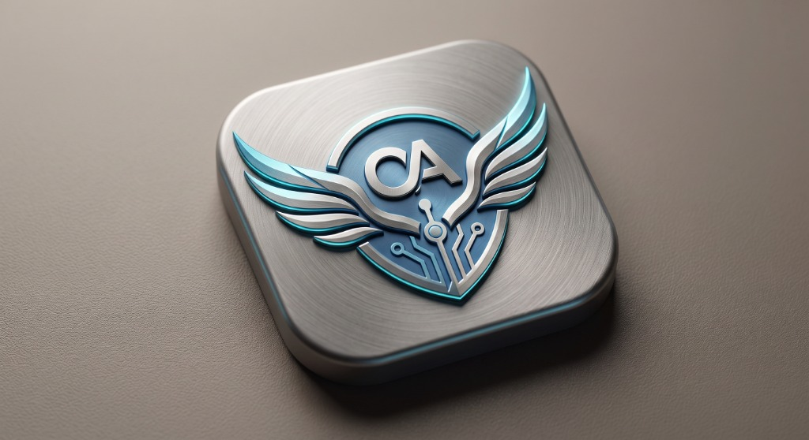
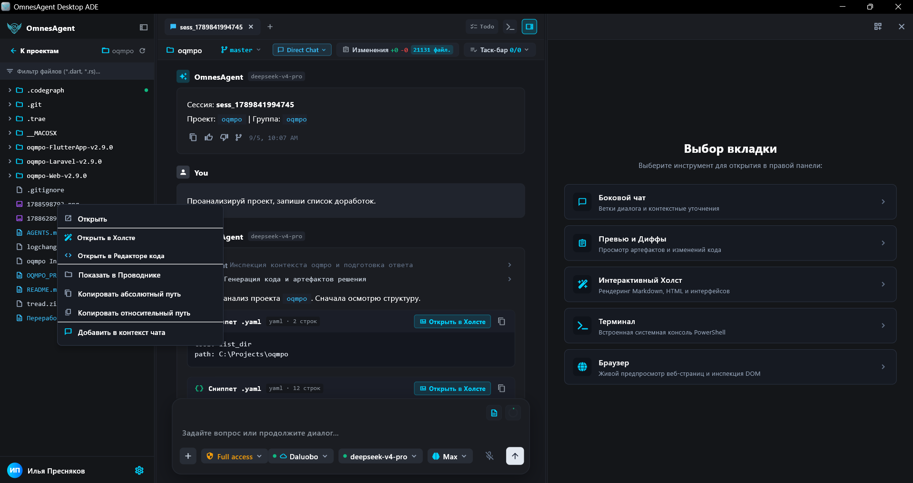
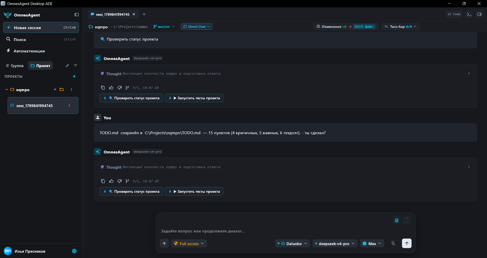
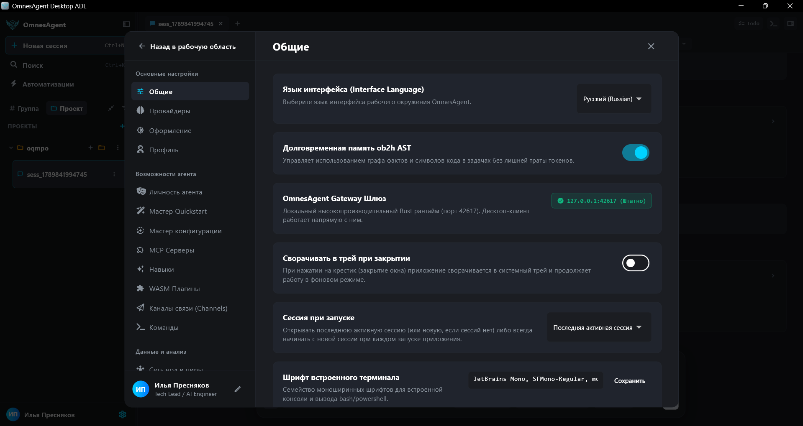
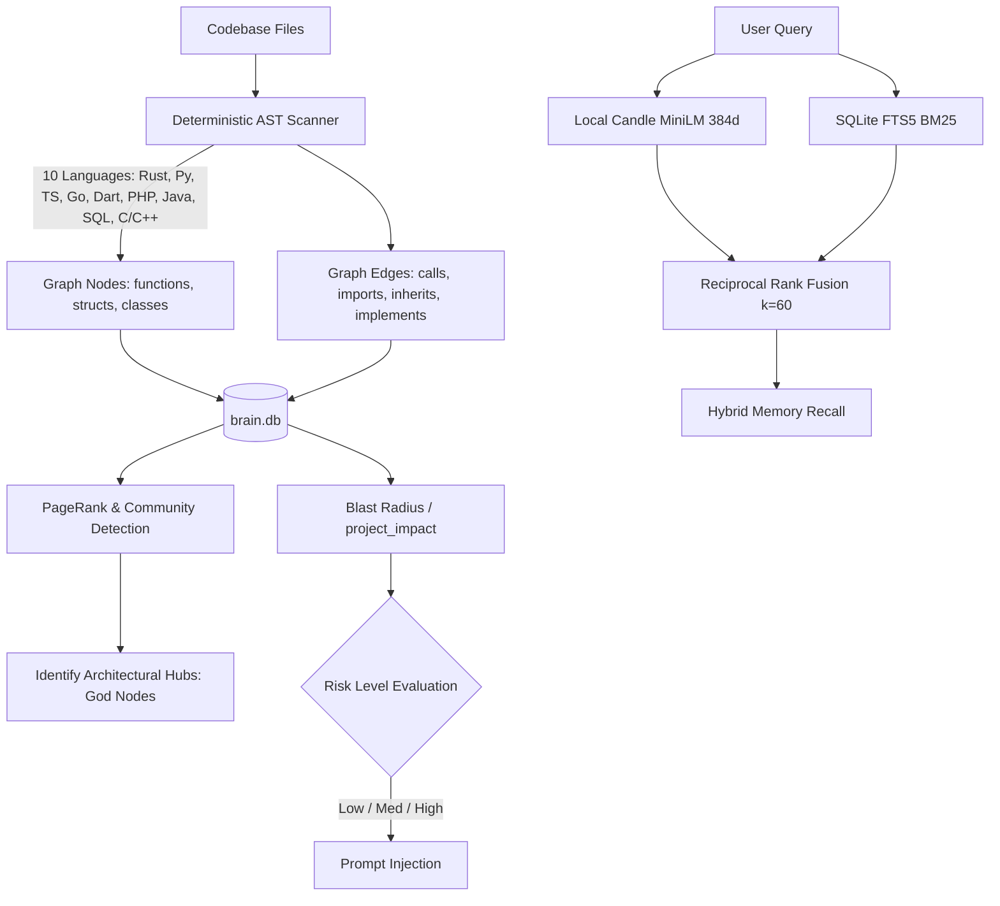

<div align="center">



# Omnes Agent

**Next-Generation Autonomous Personal AI Agent Ecosystem**  
*Ultra-fast Rust Backend · Cyberpunk Flutter Client · Deterministic KAG & AST Code Memory*

[](https://www.rust-lang.org/)
[](https://flutter.dev/)
[](LICENSE)
[]()

[**English Version**](README.en.md) | [**Русская версия**](README.md)

</div>

---

## 🌟 Overview

**Omnes Agent** is a full-featured execution and orchestration environment for autonomous personal AI assistants:
1. **Pure Rust Core & Gateway**: Reactive async daemon (`omnesagent-gateway`), modular tool execution runtime (`omnesagent-tools`), supporting multi-vendor LLM backends (OpenAI, Anthropic, Gemini, Ollama, DeepSeek, OpenRouter) and cross-channel event processing.
2. **KAG + AST Intelligence**: Deterministic static analysis for 10 programming languages with zero LLM token cost, **Blast Radius** calculation (`project_impact`), local in-process **Candle BERT MiniLM** vector embeddings (CPU), and hybrid **Reciprocal Rank Fusion (RRF $k=60$)** search.
3. **Cross-Platform Flutter Client**: Mobile and desktop application designed with a sleek **Cyber Zinc & Neon Cyan** design system (`shadcn/ui + reui`), featuring live log inspection, Gateway Doctor self-diagnostics, and skill bundle management.
4. **Memory Consolidation & Dreaming**: Background memory synthesis, user persona extraction, and workspace state checkpointing.

---

## 🖥️ Application Interface

OmnesAgent Desktop ADE is not a chat window — it is the agent's entire workspace: project context, conversation, tools and artifacts share a single screen with no app switching. The visual layer is built on the **Cyber Zinc & Neon Cyan** design system (`shadcn/ui + reui`) — dark and light schemes, a cyan accent, rounded panels and theme tokens instead of hard-coded colors.

<div align="center">
  <a href="assets/screenshots/01-workspace.png"></a>
  <br /><br />
  <em>Workspace: project tree with type filters on the left, the live agent conversation in the center, the tab panel on the right. Side Chat for clarifications, Preview & Diffs, Interactive Canvas, Terminal and Browser open in one click, while the context menu carries any file to its destination: open in Canvas or code editor, reveal in Explorer, or add to the chat context.</em>
</div>

<br />

<table>
  <tr>
    <td width="50%" valign="top">
      <a href="assets/screenshots/02-agent-chat.png"></a>
      <p><b>A conversation you can steer.</b> <code>Direct Chat</code> mode, the change counter and the task bar sit in a single row above the thread. Agent reasoning collapses into a tidy <em>Thought</em> accordion, next steps arrive as action chips ("Check project status", "Run project tests"), and every answer can be copied, rated or forked into a separate branch. The composer keeps reasoning level (<code>Low / High / Max</code>), permission mode (<code>Full access</code>) and the model picker with its provider status indicator close at hand.</p>
    </td>
    <td width="50%" valign="top">
      <a href="assets/screenshots/03-settings.png"></a>
      <p><b>Settings instead of config files.</b> Providers and appearance, agent personality, Quickstart and configuration wizards, MCP servers, skills, WASM plugins and messaging channels — all in one window. The local Rust gateway reports its state up front: <code>127.0.0.1:42617</code>, while the ob2h AST long-term memory flips on with a single toggle and wastes no tokens searching its fact and code-symbol graph.</p>
    </td>
  </tr>
</table>

---

## 🏛️ Monorepo Architecture

```
Omnes-agent/
├── assets/                  # Brand graphics, UI screenshots, and media
├── backend/                 # Rust Workspace (20+ crates)
│   ├── apps/
│   │   ├── omnescode/       # Standalone Terminal TUI coding assistant
│   │   └── omnesrelay/      # End-to-end encrypted P2P WebSocket relay
│   ├── crates/
│   │   ├── omnesagent-kag/     # KAG engine, AST parsers (10 languages), Candle MiniLM, PageRank
│   │   ├── omnesagent-memory/  # Long-term SQLite memory, hybrid RRF search, auto-migrations
│   │   ├── omnesagent-gateway/ # Control plane REST API & WebSocket server
│   │   ├── omnesagent-runtime/ # Agent loop, context injection, scheduler, worker pool
│   │   ├── omnesagent-tools/   # 90+ tools (AST code intelligence, dreaming, browser, shell, git)
│   │   ├── omnesagent-channels/# Telegram, Discord, Slack, WhatsApp, Webhooks, Matrix, AMQP
│   │   ├── omnesagent-providers/# LLM provider adapters (OpenAI, Anthropic, Gemini, DeepSeek, etc.)
│   │   └── omnesagent-config/  # Strongly-typed configuration schemas & security policies
│   └── xtask/               # Developer automation & code generation tasks
├── frontend/                # Cross-platform Flutter client
│   ├── lib/
│   │   ├── core/gateway/    # HTTP REST & WebSocket gateway clients
│   │   ├── design_system/   # Cyber components: shadcn_card, button, badge, dialog, input
│   │   └── features/        # Tools, Skills, Doctor, Logs, Integrations, Device Pairing
├── build.ps1 / build.bat    # Unified multi-target build script (Rust + Flutter)
├── run.ps1 / run.bat        # Unified launch script for gateway daemon & app
└── check.ps1 / check.bat    # Full-stack health check, tests & linting
```

---

## 🧠 KAG & AST Code Memory Architecture

Unlike naive RAG pipelines, Omnes Agent utilizes **Knowledge Augmented Generation**:



- **Deterministic AST Parsing**: Structural symbol extraction with zero token overhead and millisecond execution.
- **Blast Radius Analysis (`project_impact`)**: Reverse BFS dependency traversal evaluating refactoring risks before modifying code.
- **Architectural Analytics**: PageRank centrality, Tarjan's strongly connected components (SCC), and module instability metrics (Ca/Ce).
- **In-Process Embeddings**: Pure Rust neural inference powered by `candle-core` running offline on CPU.

---

## ⚡ Quick Start

### Prerequisites
- **Rust**: 1.85+ (Rust 2024 edition)
- **Flutter**: 3.24+
- **OS**: Windows 10/11, Linux, macOS

### 1. Build Everything
```powershell
# Build both backend (omnesagent.exe) and frontend (Desktop / Android APK):
.\build.ps1

# Or via batch file:
build.bat

# Build only the Rust backend:
.\build.ps1 -Target Backend -Mode Release
```

### 2. Run Services
```powershell
# Launch both Gateway and Flutter Client:
.\run.ps1

# Run only the headless Gateway daemon:
.\run.ps1 -Service Backend

# Launch the terminal coding TUI (omnescode):
cargo run --bin omnescode
```

### 3. Verify & Run Tests
```powershell
# Run full-stack health check:
.\check.ps1

# Run KAG and AST parser tests:
cargo test -p omnesagent-kag --lib

# Run local Candle embedding provider tests:
cargo test -p omnesagent-memory --lib factory_candle
```

### 4. Docker Deployment (Server / VPS)
To run headless OmnesAgent Gateway with built-in Web Dashboard, KAG memory, and communication channels:
```bash
# 1. Build and run in background:
docker compose up -d --build

# 2. View runtime logs:
docker compose logs -f

# 3. Access Web ADE Dashboard:
# http://localhost:42617
```
Persistent storage (SQLite `brain.db`, KAG indices, configuration) is automatically maintained in the `omnesagent-data` Docker volume.

---

## 🛠️ Built-in Tool Arsenal

Omnes Agent comes out-of-the-box with 90+ tools:
- **`project_code`**: `project_init`, `project_scan`, `project_impact`, `project_context`, `project_graph_search`, `project_report`.
- **`dream_tool`**: `dream_run` (memory consolidation), `dream_status`, `dream_restore`.
- **Developer Tools**: `file_edit`, `file_write`, `file_download`, `git_operations`, `shell_exec`.
- **Research & Web**: `web_search`, `web_fetch`, `content_search`, `browser_open`.
- **Omnichannel**: Inbound/outbound adapters for Telegram, Discord, Slack, Pushover, Email IMAP/SMTP.

---

## 📜 License

This project is licensed under the **MIT License**. See the [LICENSE](LICENSE) file for details.
