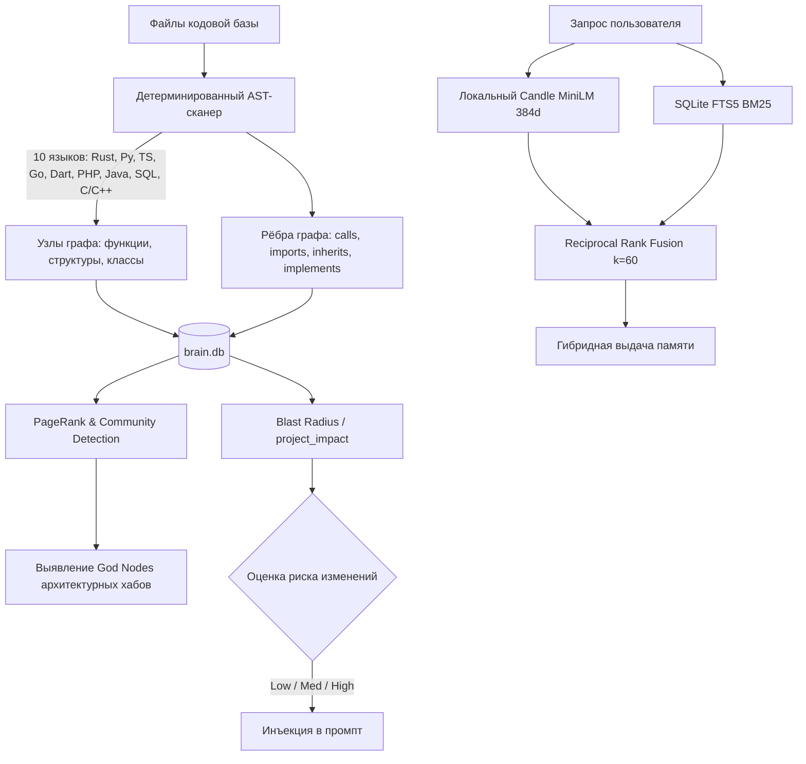

<div align="center">


# Omnes Agent

**Автономная персональная экосистема AI-агентов нового поколения**  
*Высокопроизводительный Rust-бэкенд · Мультимодальный Flutter-клиент · Детерминированная KAG и AST-память кодовой базы*

[](https://www.rust-lang.org/)
[](https://flutter.dev/)
[](LICENSE)
[]()

[**English Version**](README.en.md) | [**Русская версия**](README.md)

</div>

---

## 🌟 Обзор платформы

**Omnes Agent** — это полнофункциональная среда исполнения и оркестрации автономных AI-ассистентов, объединяющая:
1. **Ядро агента на чистом Rust**: реактивный асинхронный шлюз (`omnesagent-gateway`), модульная система инструментов (`omnesagent-tools`), поддержка десятков моделей (OpenAI, Anthropic, Gemini, Ollama, DeepSeek, OpenRouter) и множества каналов связи.
2. **Интеллектуальная память KAG + AST**: детерминированный статический анализ 10 языков программирования без расхода токенов LLM, вычисление радиуса влияния изменений (**Blast Radius**), локальные векторные эмбеддинги **Candle MiniLM** (in-process на CPU) и гибридный поиск **RRF ($k=60$)**.
3. **Кроссплатформенный клиент Flutter**: десктопное и мобильное приложение с эстетикой **Cyber Zinc & Neon Cyan** (`shadcn/ui + reui`), мониторингом логов в реальном времени, встроенной диагностикой (Doctor) и управлением навыками.
4. **Консолидация и Дриминг**: фоновый синтез долговременной памяти агента, профилирование пользователя и версионирование рабочей области.

---

## 🖥️ Интерфейс приложения

OmnesAgent Desktop ADE — это не чат в окне, а рабочее пространство агента целиком: контекст проекта, диалог, инструменты и артефакты живут на одном экране и не требуют переключения между приложениями. Визуальный слой собран на дизайн-системе **Cyber Zinc & Neon Cyan** (`shadcn/ui + reui`) — тёмная и светлая схемы, циановый акцент, скруглённые панели и токены темы вместо хардкода цветов.

<div align="center">
  <a href="assets/screenshots/01-workspace.png"></a>
  <br /><br />
  <em>Рабочее пространство: слева — дерево проекта с фильтром по типам файлов, в центре — живой диалог с агентом, справа — панель вкладок. Боковой чат для уточнений, Превью и Диффы, Интерактивный Холст, Терминал и Браузер открываются в один клик, а контекстное меню доводит любой файл до дела: открыть в Холсте или редакторе кода, показать в проводнике, добавить в контекст чата.</em>
</div>

<br />

<table>
  <tr>
    <td width="50%" valign="top">
      <a href="assets/screenshots/02-agent-chat.png"></a>
      <p><b>Диалог как управляемый процесс.</b> Режим <code>Direct Chat</code>, счётчик изменений и таск-бар — в одной строке над лентой. Размышления агента свёрнуты в аккуратный блок <em>Thought</em>, следующие шаги предложены чипами («Проверить статус проекта», «Запустить тесты проекта»), а ответ можно скопировать, оценить или ответвить в отдельную ветку. В строке ввода всегда под рукой уровень размышлений <code>Low / High / Max</code>, режим доступа <code>Full access</code> и выбор модели с индикатором состояния провайдера.</p>
    </td>
    <td width="50%" valign="top">
      <a href="assets/screenshots/03-settings.png"></a>
      <p><b>Настройки вместо конфигов.</b> Провайдеры и оформление, личность агента, Мастера Quickstart и конфигурации, MCP-серверы, навыки, WASM-плагины и каналы связи — всё в одном окне. Состояние локального Rust-шлюза видно сразу: <code>127.0.0.1:42617 (Штатно)</code>, а долговременная память ob2h AST включается одним тумблером и не тратит лишних токенов на поиск по графу фактов и символов кода.</p>
    </td>
  </tr>
</table>

---

## 🏛️ Архитектура монорепозитория

```
Omnes-agent/
├── assets/                  # Графика, эмблема, скриншоты интерфейса и медиа-ресурсы
├── backend/                 # Rust Workspace (20+ крейтов)
│   ├── apps/
│   │   ├── omnescode/       # Автономное терминальное TUI-приложение для кодинга
│   │   └── omnesrelay/      # Сквозной P2P-релей с E2E-шифрованием
│   ├── crates/
│   │   ├── omnesagent-kag/     # Движок KAG, AST-парсеры (10 языков), Candle MiniLM, PageRank
│   │   ├── omnesagent-memory/  # Долговременная память SQLite, гибридный RRF-поиск, миграции
│   │   ├── omnesagent-gateway/ # REST API и WebSocket сервер управления
│   │   ├── omnesagent-runtime/ # Исполняемый цикл агента, инъекция контекста, планировщик
│   │   ├── omnesagent-tools/   # 90+ инструментов (AST-код, дриминг, браузер, терминал, файлы)
│   │   ├── omnesagent-channels/# Telegram, Discord, Slack, WhatsApp, Webhooks, Matrix, AMQP
│   │   ├── omnesagent-providers/# Провайдеры LLM (OpenAI, Anthropic, Gemini, DeepSeek, Local)
│   │   └── omnesagent-config/  # Строго типизированные схемы конфигурации
│   └── xtask/               # Вспомогательные задачи автоматизации и кодогенерации
├── frontend/                # Кроссплатформенный Flutter-клиент
│   ├── lib/
│   │   ├── core/gateway/    # HTTP REST и WebSocket клиенты взаимодействия со шлюзом
│   │   ├── design_system/   # Кибер-компоненты: shadcn_card, button, badge, dialog, input
│   │   └── features/        # Tools, Skills, Doctor, Logs, Integrations, Pairing
├── build.ps1 / build.bat    # Скрипт полной сборки (Rust + Flutter)
├── run.ps1 / run.bat        # Скрипт запуска шлюза и клиента
└── check.ps1 / check.bat    # Комплексная проверка целостности и линтинг
```

---

## 🧠 Подсистема KAG & AST памяти кода

В отличие от классического наивного RAG, в Omnes Agent внедрена архитектура **Knowledge Augmented Generation**:



- **Детерминированный AST-анализ**: парсинг кода без затрат токенов и задержек сетевых запросов.
- **Анализ радиуса изменений (Blast Radius)**: алгоритмический BFS-расчёт обратных зависимостей перед рефакторингом.
- **Архитектурная аналитика**: PageRank, поиск циклических зависимостей алгоритмом Тарьяна (SCC), детектирование нестабильности модулей.
- **Локальный нейросетевой поиск**: встроенный легковесный инференс векторов через `candle-core` на CPU.

---

## ⚡ Быстрый старт

### Требования
- **Rust**: 1.85+ (Rust 2024 edition)
- **Flutter**: 3.24+
- **ОС**: Windows 10/11, Linux, macOS

### 1. Сборка всех компонентов
```powershell
# Полная сборка backend (omnesagent.exe) и frontend (Windows / Android APK):
.\build.ps1

# Или через bat-скрипт:
build.bat

# Собрать только backend:
.\build.ps1 -Target Backend -Mode Release
```

### 2. Запуск экосистемы
```powershell
# Запуск шлюза и Flutter-клиента:
.\run.ps1

# Запуск только фонового шлюза Omnes Gateway:
.\run.ps1 -Service Backend

# Запуск терминального TUI-режима кодинга:
cargo run --bin omnescode
```

### 3. Запуск тестов и валидация
```powershell
# Комплексный тест:
.\check.ps1

# Тесты KAG и AST-модулей:
cargo test -p omnesagent-kag --lib

# Тест локальных Candle-эмбеддингов:
cargo test -p omnesagent-memory --lib factory_candle
```

### 4. Развертывание в Docker (Сервер / VPS)
Для автономной работы шлюза с веб-панелью управления, KAG-памятью и каналами связи:
```bash
# 1. Запустить контейнер в фоновом режиме:
docker compose up -d --build

# 2. Просмотреть логи работы шлюза:
docker compose logs -f

# 3. Открыть веб-интерфейс ADE в браузере:
# http://localhost:42617
```
Все данные (база знаний SQLite `brain.db`, векторные индексы и конфигурация) сохраняются в постоянном томе `omnesagent-data`.

---

## 🛠️ Встроенные инструменты агента

Omnes Agent поставляется с обширным набором инструментов:
- **`project_code`**: `project_init`, `project_scan`, `project_impact`, `project_context`, `project_graph_search`, `project_report`.
- **`dream_tool`**: `dream_run` (консолидация воспоминаний), `dream_status`, `dream_restore`.
- **Инструменты разработчика**: `file_edit`, `file_write`, `file_download`, `git_operations`, `shell_exec`.
- **Поиск и интернет**: `web_search`, `web_fetch`, `content_search`, `browser_open`.
- **Коммуникации**: интеграция каналов Telegram, Discord, Slack, Pushover, Email IMAP/SMTP.

---

## 📜 Лицензия

Проект распространяется под свободной лицензией **MIT**. Подробности в файле [LICENSE](LICENSE).
